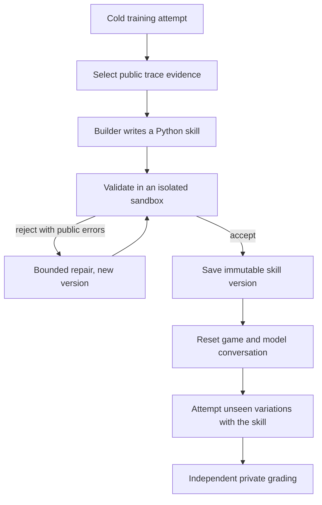

# noob-agent

noob-agent measures how well an AI model **learns** inside a game it has never
seen. It doesn't just check whether the model can finish a fixed task.

A model starts as a "noob": it gets the same basic new-player senses and
controls as every other model (observe, move, inspect, pick up, interact). Nobody
tells it how the unfamiliar objects work or what steps reach the goal. It has to
experiment, turn what it discovers into reusable Python **skills**, and then use
those skills on variations it never saw while learning.

The central question:

> Given the same new-player controls, unfamiliar environment, feedback, and
> learning budget, how effectively can a model turn experience into a reliable
> skill that works on unseen variations?

Self-improvement here means building and keeping tested code. It does **not**
mean fine-tuning or changing model weights.

## What is working today

This is a hackathon prototype, not a finished benchmark. The shared learning
loop, Minecraft and Doom connectors, persistent run records, skill validation,
and deterministic tests are in the repository. The current live evidence is
more limited:

- A hand-written fixture skill passes the deterministic Doom learning loop.
  That fixture tests the plumbing and is not a model result.
- The recorded Doom model run did not produce an accepted skill. The model
  exhausted its action budget without killing the target, and the Builder
  reply was cut off at its output limit.
- The live Minecraft clean-versus-faulty grading path and independent defect
  reproduction are not complete.

The repo is ready to support a first technical phase and a credible prototype
review. It should not claim that the full cross-game benchmark is finished.

## How it works

Two loops run at different speeds.

**Fast action loop.** The Action agent repeatedly observes the public game state,
chooses one primitive action or accepted skill, executes it through a game
connector, and records the result. An attempt ends on success, a budget limit, no
progress, or an infrastructure failure.

**Slow improvement loop.**



The accepted skill is the only thing carried across the reset. Held-out grader
feedback never goes back to the Builder, and the connector, grader, scenario
split, budgets, and prompts stay fixed, so the system can't raise its score by
editing the test.

## What it compares

- **Cold condition:** primitive tools only.
- **Self-improving condition:** same tools and budget, plus skills the model
  built and validated from its own training attempts.
- **Notes control:** same evidence and learning budget, but it keeps a written
  playbook instead of executable code. This checks whether validated skills add
  value beyond reflection.

Results are a small scorecard, not one opaque number. It separates initial
ability, skill-building, repair, transfer to unseen variations, defect discovery
and reproduction (clean vs. faulty scenario twins), and cost in actions, model
calls, tokens, time, and dollars. Every step is recorded in SQLite and mirrored
to W&B Weave for inspection.

## Terms used in this repository

- **Action agent:** the model that chooses what to do in the game.
- **Builder agent:** the model call that writes a skill from a public training
  trace or repairs a rejected skill.
- **Primitive:** one low-level game action, such as `observe`, `move`, `attack`,
  or `use_object`.
- **Connector:** the adapter that translates the shared action format into one
  game's controls and returns structured observations and results.
- **Skill:** a generated Python function that calls approved primitives to do a
  repeated task. Accepted skills are versioned and immutable.
- **Training episode:** the first attempt, where the model explores and leaves
  evidence for the Builder.
- **Held-out episode:** a fresh task variation the Builder did not see. It
  tests transfer rather than memory of the original run.
- **Independent grader:** code outside the model conversation that checks the
  actual game outcome.
- **Defect reproduction:** a fresh reset that replays evidence for a reported
  bug to check whether the bug is real and repeatable.
- **Scenario:** a declared task with rules, reset behavior, budgets, and
  training or held-out variations.
- **Seed:** a fixed number that makes a scenario reset reproducible.
- **Weave:** W&B's tracing and evaluation product. Here it mirrors local run
  records so a person can inspect model calls and episode steps.
- **W&B Inference:** the model-serving interface used by the configured client.
- **SQLite:** the local database that stores experiments, episodes, steps,
  model calls, skills, and grading records.
- **CoreWeave Sandbox:** the intended isolated runtime for generated skills.
  The local subprocess fallback is weaker and is labeled as such.
- **ViZDoom:** the Python Doom environment used by the second connector.
- **Mineflayer:** the Node.js library used to connect to Minecraft.
- **Sidecar:** the helper process that runs Mineflayer and exchanges
  newline-delimited JSON messages with Python.
- **JSON Lines:** a text format with one JSON object per line, used by that
  Python-to-Node connection.
- **Data pack:** Minecraft files that add commands and game behavior without a
  custom mod.
- **BDP:** "Basic Demoable Product," the smallest complete demonstration
  target described in [`hackathon_plan.md`](hackathon_plan.md).

## Games

The same learning architecture runs on two deliberately different games. Each
game supplies a public goal, observations, reset, and a frozen primitive control
set.

- **Minecraft** (primary): a local vanilla Java 1.21.1 server, a data-pack
  scenario with an unfamiliar mechanic, and a Mineflayer connector. See
  [`docs/minecraft-server.md`](docs/minecraft-server.md).
- **Doom** via ViZDoom: fast, real-time, Python-native, and fully resettable. See
  [`docs/doom-env.md`](docs/doom-env.md).

Two working games do not prove universal support. Generality stays a hypothesis.

## Repository map

```text
src/noob_agent/
  agents/          Action and Builder model roles
  connectors/      Minecraft, Doom, and fake game adapters
  domain/          Typed records and public contracts
  grading/         Independent outcome checks and reproduction
  models/          Model client and call recording
  observability/   Weave trace mirror and scorecards
  prompts/         Action, Builder, and refinement prompts
  runtime/         Episode and improvement-loop orchestration
  skills/          Skill packages, policy, registry, and execution
  storage/         SQLite schema and repository
  verification/    Skill validation

scenarios/         Versioned game scenarios and seeds
scripts/           Demo, replay, benchmark, and live-view entry points
tests/             Unit, integration, and live-environment contract tests
docs/              Operational guides and implementation status
assets/            Checked-in visual evidence
```

Specifications:

- [`hackathon_plan.md`](hackathon_plan.md): authoritative scope and build order
- [`connector_contract.md`](connector_contract.md): observations, primitives, and action accounting
- [`skill_contract.md`](skill_contract.md): generated skills, permissions, and validation
- [`minecraft_scenario.md`](minecraft_scenario.md): the Minecraft task, worlds, and private grading
- [`eval_protocol.md`](eval_protocol.md): conditions, budgets, metrics, and publication rules
- [`docs/current-status.md`](docs/current-status.md) and [`docs/loop-optimization.md`](docs/loop-optimization.md): implementation status and loop scorecards

## Getting started

Requires Python 3.11+ and [uv](https://docs.astral.sh/uv/).

```sh
uv sync --group dev
uv run pytest
```

Copy `.env.example` to `.env` and fill in only the credentials for the
integrations you enable (W&B Inference, Weave, CoreWeave Sandbox). All
integrations are disabled by default, and tests don't need credentials.

```sh
# One live Doom learning sequence: cold training, Builder, graded held-out cells.
NOOB_AGENT_SANDBOX_MODE=local uv run --env-file .env python scripts/run_doom_learning_sequence.py

# Benchmark the loop on fixed seeds and write a scorecard.
NOOB_AGENT_SANDBOX_MODE=local uv run --env-file .env python scripts/loop_bench.py run --sequences 5

# Watch a run's reasoning live from Weave.
uv run --env-file .env python scripts/live_reasoning_view.py --run-id <sequence-id>
```

`NOOB_AGENT_SANDBOX_MODE=local` uses a labeled local subprocess executor, which
is weaker isolation than CoreWeave Sandbox. Generated code is time-limited and
gets a narrow API, but this prototype makes no production security claim.

## Contributing

See [`AGENTS.md`](AGENTS.md). Work on feature branches, open pull requests into
`main`, stage one file per commit, and add a `CHANGELOG.md` entry for every
change.
