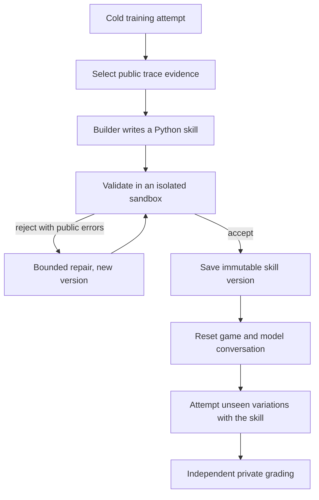

# noob-agent

noob-agent measures how well an AI model **learns** inside a game it has never
seen. It doesn't just check whether the model can finish a fixed task.

A model starts as a "noob": it gets the same basic new-player senses and
controls as every other model (observe, move, inspect, pick up, interact). Nobody
tells it how the unfamiliar objects work or what steps reach the goal. It has to
experiment, turn what it discovers into reusable Python **skills**, and then use
those skills on variations it never saw while learning.

The central question:

> Given the same new-player controls, unfamiliar environment, feedback, and
> learning budget, how effectively can a model turn experience into a reliable
> skill that works on unseen variations?

Self-improvement here means building and keeping tested code. It does **not**
mean fine-tuning or changing model weights.

## How it works

Two loops run at different speeds.

**Fast action loop.** The Action agent repeatedly observes the public game state,
chooses one primitive action or accepted skill, executes it through a game
connector, and records the result. An attempt ends on success, a budget limit, no
progress, or an infrastructure failure.

**Slow improvement loop.**



The accepted skill is the only thing carried across the reset. Held-out grader
feedback never goes back to the Builder, and the connector, grader, scenario
split, budgets, and prompts stay fixed, so the system can't raise its score by
editing the test.

## What it compares

- **Cold condition:** primitive tools only.
- **Self-improving condition:** same tools and budget, plus skills the model
  built and validated from its own training attempts.
- **Notes control:** same evidence and learning budget, but it keeps a written
  playbook instead of executable code. This checks whether validated skills add
  value beyond reflection.

Results are a small scorecard, not one opaque number. It separates initial
ability, skill-building, repair, transfer to unseen variations, defect discovery
and reproduction (clean vs. faulty scenario twins), and cost in actions, model
calls, tokens, time, and dollars. Every step is recorded in SQLite and mirrored
to W&B Weave for inspection.

## Games

The same learning architecture runs on two deliberately different games. Each
game supplies a public goal, observations, reset, and a frozen primitive control
set.

- **Minecraft** (primary): a local vanilla Java 1.21.1 server, a data-pack
  scenario with an unfamiliar mechanic, and a Mineflayer connector. See
  [`docs/minecraft-server.md`](docs/minecraft-server.md).
- **Doom** via ViZDoom: fast, real-time, Python-native, and fully resettable. See
  [`docs/doom-env.md`](docs/doom-env.md).

Two working games do not prove universal support. Generality stays a hypothesis.

## Repository map

| Path | Contents |
| --- | --- |
| `src/noob_agent/agents`, `prompts` | Action agent and Builder |
| `src/noob_agent/connectors` | Minecraft and Doom connectors, plus a deterministic fake |
| `src/noob_agent/skills`, `verification` | Skill format, validation, immutable registry, executor |
| `src/noob_agent/runtime` | Episode runner and learning sequence |
| `src/noob_agent/grading` | Independent private graders and reproduction |
| `src/noob_agent/storage`, `observability` | SQLite source of truth and Weave mirror |
| `scenarios/` | Game scenarios, manifests, and precommitted seeds |
| `scripts/` | Learning runs, loop benchmark, episode replay, live reasoning view |

Specifications:

- [`hackathon_plan.md`](hackathon_plan.md): authoritative scope and build order
- [`connector_contract.md`](connector_contract.md): observations, primitives, and action accounting
- [`skill_contract.md`](skill_contract.md): generated skills, permissions, and validation
- [`minecraft_scenario.md`](minecraft_scenario.md): the Minecraft task, worlds, and private grading
- [`eval_protocol.md`](eval_protocol.md): conditions, budgets, metrics, and publication rules
- [`docs/current-status.md`](docs/current-status.md) and [`docs/loop-optimization.md`](docs/loop-optimization.md): implementation status and loop scorecards

## Getting started

Requires Python 3.11+ and [uv](https://docs.astral.sh/uv/).

```sh
uv sync --group dev
uv run pytest
```

Copy `.env.example` to `.env` and fill in only the credentials for the
integrations you enable (W&B Inference, Weave, CoreWeave Sandbox). All
integrations are disabled by default, and tests don't need credentials.

```sh
# One live Doom learning sequence: cold training, Builder, graded held-out cells.
NOOB_AGENT_SANDBOX_MODE=local uv run --env-file .env python scripts/run_doom_learning_sequence.py

# Benchmark the loop on fixed seeds and write a scorecard.
NOOB_AGENT_SANDBOX_MODE=local uv run --env-file .env python scripts/loop_bench.py run --sequences 5

# Watch a run's reasoning live from Weave.
uv run --env-file .env python scripts/live_reasoning_view.py --run-id <sequence-id>
```

`NOOB_AGENT_SANDBOX_MODE=local` uses a labeled local subprocess executor, which
is weaker isolation than CoreWeave Sandbox. Generated code is time-limited and
gets a narrow API, but this prototype makes no production security claim.

## Contributing

See [`AGENTS.md`](AGENTS.md). Work on feature branches, open pull requests into
`main`, stage one file per commit, and add a `CHANGELOG.md` entry for every
change.
