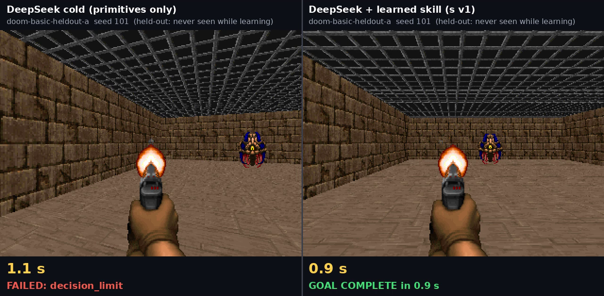
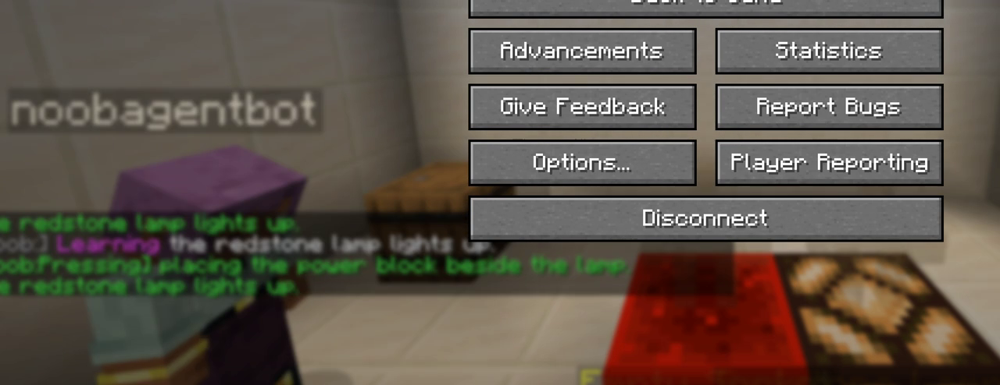
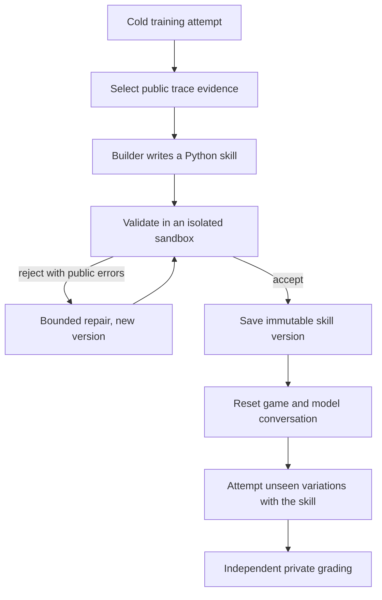

# noob-agent

noob-agent measures how well an AI model **learns** inside a game it has never
seen. It doesn't just check whether the model can finish a fixed task.

A model starts as a "noob": it gets the same basic new-player senses and
controls as every other model (observe, move, inspect, pick up, interact). Nobody
tells it how the unfamiliar objects work or what steps reach the goal. It has to
experiment, turn what it discovers into reusable Python **skills**, and then use
those skills on variations it never saw while learning.

The central question:

> Given the same new-player controls, unfamiliar environment, feedback, and
> learning budget, how effectively can a model turn experience into a reliable
> skill that works on unseen variations?

Self-improvement here means building and keeping tested code. It does **not**
mean fine-tuning or changing model weights.

## What it looks like

**Doom:** the same model on a held-out seed it never saw while learning. On the
left it has primitives only; on the right it also has a skill it wrote and
validated from its own training attempt.



**Minecraft:** the redstone lamp exercise. The bot (`noobagentbot`) takes a
redstone block from a barrel and places it beside the lamp. Its in-game chat
narrates each step (`Seeing`, `Doing`, `Pressing`, `Learning`), and the lamp
lights once Minecraft reports it powered. This frame comes from a demo
recording of the exercise. It is not a graded model result; see
[What is working today](#what-is-working-today) for the recorded model run.



## What is working today

This is a hackathon prototype, not a finished benchmark. The shared learning
loop, Minecraft and Doom connectors, persistent run records, skill validation,
Weave tracing, and deterministic tests are in the repository. All live numbers
below come from `deepseek-ai/DeepSeek-V4-Flash-0731` on W&B Inference, with
skills run in the labeled local subprocess. Full scorecards are in
[`docs/loop-optimization.md`](docs/loop-optimization.md).

**Doom: the model now learns skills reliably, but transfer is uneven.**

- After the loop fixes in plan sections 22–24, the model wrote a skill that
  passed validation in 5 of 5 benchmark sequences, up from 1 of 5. None of 597
  Action replies were unusable, and no sequence exceeded a protocol ceiling.
  Before these fixes, about half of Action replies were cut off at their token
  cap.
- Held-out success (`loop-bench-24b-r2`): 8 of 30 goals. The best sequence
  solved all 4 practice seeds and 5 of 6 held-out cells. The other four solved
  0 or 1 of 6 each.
- Practice scores agreed with the private grader on every episode, so practice
  is a trustworthy signal for keeping or dropping a skill version.
- Multi-round refinement runs, but it has not improved held-out results yet.
  The two refinements kept only used fewer primitives. Three of 5 sequences
  stopped on the 140-call learning budget after one refinement round.
- The Doom comparison image above is one demo recording on one held-out seed.
  Skill quality varies between learning sequences, so a rerun can differ.

**Minecraft: the Action loop works live, but the full learning loop is not
proven yet.**

- On the live server, a cold training episode had 0 of 10 unusable replies and
  a 690 ms median decision.
- In the recorded redstone lamp run (`minecraft-redstone-20260913T191654Z`),
  the cold attempt lit the lamp in 9 decisions, including one rejected block
  placement. The Builder's reply was unusable, so no skill was learned and
  there was no skill-reuse attempt. A second run ran out of decisions without
  lighting the lamp and then timed out. That redstone runner is not on `main`
  yet.
- Minecraft observations are large. A 20-decision training episode used 43,752
  tokens, over the 40,000-token ceiling. PR #68 cuts the observation size but
  has not met its target.
- The Resonator clean-versus-faulty grading path and independent defect
  reproduction are not complete.

**Not yet built:** the CoreWeave Sandbox executor; so far skills run only in
the local subprocess.

The repo supports a credible prototype review. It should not claim that the
full cross-game benchmark is finished.

## How it works

Two loops run at different speeds.

**Fast action loop.** The Action agent repeatedly observes the public game state,
chooses one primitive action or accepted skill, executes it through a game
connector, and records the result. An attempt ends on success, a budget limit, no
progress, or an infrastructure failure.

**Slow improvement loop.**



The accepted skill is the only thing carried across the reset. Held-out grader
feedback never goes back to the Builder, and the connector, grader, scenario
split, budgets, and prompts stay fixed, so the system can't raise its score by
editing the test.

## What it compares

- **Cold condition:** primitive tools only.
- **Self-improving condition:** same tools and budget, plus skills the model
  built and validated from its own training attempts.
- **Notes control:** same evidence and learning budget, but it keeps a written
  playbook instead of executable code. This checks whether validated skills add
  value beyond reflection.

Results are a small scorecard, not one opaque number. It separates initial
ability, skill-building, repair, transfer to unseen variations, defect discovery
and reproduction (clean vs. faulty scenario twins), and cost in actions, model
calls, tokens, time, and dollars. Every step is recorded in SQLite and mirrored
to W&B Weave for inspection.

## How we used W&B Weave, the sandbox, and traces

**Traces are the record of every run.** SQLite is the source of truth. After
each event is safely written there, `WeaveTraceSink`
([`src/noob_agent/observability/tracing.py`](src/noob_agent/observability/tracing.py))
mirrors it to W&B Weave as a nested call tree:

- `noob_agent.episode`: one call per training, practice, or held-out attempt.
- `noob_agent.step`: one child call per recorded step, holding the Action
  agent's subgoal, expected evidence, chosen action, arguments, result,
  latency, and tokens.
- `noob_agent.model_call`: every model call. Action calls nest under their
  episode. Builder and refinement calls sit at the top level, since no episode
  is open while they run.

Tracing is best effort. A slow or unreachable Weave backend can never change a
recorded attempt. Concurrent held-out cells keep their own call trees, and
tracing is flushed once after all cells finish.

**Weave is also what we read from, not only what we write to.**

- [`scripts/live_reasoning_view.py`](scripts/live_reasoning_view.py) polls
  Weave (never SQLite) for one run's calls and serves a local page beside the
  game. The page shows each decision's reasoning and result, the Builder's
  generated code, episode outcomes, and a link to every call in Weave. In a
  live demo, decisions appeared a median 2.0 s after the model replied.
- [`scripts/doom_demo_log.py`](scripts/doom_demo_log.py) builds the Doom demo
  transcript from Weave calls.
- Model calls go through W&B Inference with the same `WANDB_API_KEY`.
  Traces are how we debugged the loop. For example, they showed Action replies
  that could not be parsed, a Builder reply cut off at its output cap, and a
  Weave flush that deadlocked concurrent episodes. See
  [`docs/loop-optimization.md`](docs/loop-optimization.md).

**Sandbox: generated skills never run in the agent process.** A skill starts as
untrusted, model-written Python. It goes through these checks:

1. A static policy check parses the source with `ast` without running it, and
   rejects forbidden imports and builtins
   ([`src/noob_agent/skills/policy.py`](src/noob_agent/skills/policy.py)).
2. The validator runs the candidate through replay, negative-case, and
   variation phases in the configured executor. Only an accepted version is
   saved, and saved versions are immutable.
3. At run time the skill executes in a separate worker process
   ([`src/noob_agent/skills/worker.py`](src/noob_agent/skills/worker.py)).
   The worker loads it with guarded builtins and imports, and the skill can
   only reach the game through a narrow `SkillContext` (`observe`, `call`,
   `remaining_budget`, `log`) relayed as JSON Lines. It is time-limited, and
   every primitive it uses counts against the same action budget.

The executor interface is designed for CoreWeave Sandbox
(`NOOB_AGENT_SANDBOX_MODE=serverless` or `cks`), but that backend is not
implemented yet. Asking for it fails loudly rather than quietly falling back.
Every recorded run so far used `NOOB_AGENT_SANDBOX_MODE=local`, the restricted
local subprocess. Each of its results is labeled `local-subprocess` so a report
cannot mistake it for a sandbox run. It enforces no network or memory limit.

## Terms used in this repository

- **Action agent:** the model that chooses what to do in the game.
- **Builder agent:** the model call that writes a skill from a public training
  trace or repairs a rejected skill.
- **Primitive:** one low-level game action, such as `observe`, `move`, `attack`,
  or `use_object`.
- **Connector:** the adapter that translates the shared action format into one
  game's controls and returns structured observations and results.
- **Skill:** a generated Python function that calls approved primitives to do a
  repeated task. Accepted skills are versioned and immutable.
- **Training episode:** the first attempt, where the model explores and leaves
  evidence for the Builder.
- **Held-out episode:** a fresh task variation the Builder did not see. It
  tests transfer rather than memory of the original run.
- **Independent grader:** code outside the model conversation that checks the
  actual game outcome.
- **Defect reproduction:** a fresh reset that replays evidence for a reported
  bug to check whether the bug is real and repeatable.
- **Scenario:** a declared task with rules, reset behavior, budgets, and
  training or held-out variations.
- **Seed:** a fixed number that makes a scenario reset reproducible.
- **Weave:** W&B's tracing and evaluation product. Here it mirrors local run
  records so a person can inspect model calls and episode steps.
- **W&B Inference:** the model-serving interface used by the configured client.
- **SQLite:** the local database that stores experiments, episodes, steps,
  model calls, skills, and grading records.
- **CoreWeave Sandbox:** the intended isolated runtime for generated skills.
  The local subprocess fallback is weaker and is labeled as such.
- **ViZDoom:** the Python Doom environment used by the second connector.
- **Mineflayer:** the Node.js library used to connect to Minecraft.
- **Sidecar:** the helper process that runs Mineflayer and exchanges
  newline-delimited JSON messages with Python.
- **JSON Lines:** a text format with one JSON object per line, used by that
  Python-to-Node connection.
- **Data pack:** Minecraft files that add commands and game behavior without a
  custom mod.
- **BDP:** "Basic Demoable Product," the smallest complete demonstration
  target described in [`hackathon_plan.md`](hackathon_plan.md).

## Games

The same learning architecture runs on two deliberately different games. Each
game supplies a public goal, observations, reset, and a frozen primitive control
set.

- **Minecraft** (primary): a local vanilla Java 1.21.1 server, a data-pack
  scenario with an unfamiliar mechanic, and a Mineflayer connector. See
  [`docs/minecraft-server.md`](docs/minecraft-server.md).
- **Doom** via ViZDoom: fast, real-time, Python-native, and fully resettable. See
  [`docs/doom-env.md`](docs/doom-env.md).

Two working games do not prove universal support. Generality stays a hypothesis.

## Repository map

```text
src/noob_agent/
  agents/          Action and Builder model roles
  connectors/      Minecraft, Doom, and fake game adapters
  domain/          Typed records and public contracts
  grading/         Independent outcome checks and reproduction
  models/          Model client and call recording
  observability/   Weave trace mirror and scorecards
  prompts/         Action, Builder, and refinement prompts
  runtime/         Episode and improvement-loop orchestration
  skills/          Skill packages, policy, registry, and execution
  storage/         SQLite schema and repository
  verification/    Skill validation

scenarios/         Versioned game scenarios and seeds
scripts/           Demo, replay, benchmark, and live-view entry points
tests/             Unit, integration, and live-environment contract tests
docs/              Operational guides and implementation status
assets/            Checked-in visual evidence
```

Specifications:

- [`hackathon_plan.md`](hackathon_plan.md): authoritative scope and build order
- [`connector_contract.md`](connector_contract.md): observations, primitives, and action accounting
- [`skill_contract.md`](skill_contract.md): generated skills, permissions, and validation
- [`minecraft_scenario.md`](minecraft_scenario.md): the Minecraft task, worlds, and private grading
- [`eval_protocol.md`](eval_protocol.md): conditions, budgets, metrics, and publication rules
- [`docs/current-status.md`](docs/current-status.md) and [`docs/loop-optimization.md`](docs/loop-optimization.md): implementation status and loop scorecards

## Getting started

Requires Python 3.11+ and [uv](https://docs.astral.sh/uv/).

```sh
uv sync --group dev
uv run pytest
```

Copy `.env.example` to `.env` and fill in only the credentials for the
integrations you enable (W&B Inference, Weave, CoreWeave Sandbox). All
integrations are disabled by default, and tests don't need credentials.

```sh
# One live Doom learning sequence: cold training, Builder, graded held-out cells.
NOOB_AGENT_SANDBOX_MODE=local uv run --env-file .env python scripts/run_doom_learning_sequence.py

# Benchmark the loop on fixed seeds and write a scorecard.
NOOB_AGENT_SANDBOX_MODE=local uv run --env-file .env python scripts/loop_bench.py run --sequences 5

# Watch a run's reasoning live from Weave.
uv run --env-file .env python scripts/live_reasoning_view.py --run-id <sequence-id>
```

`NOOB_AGENT_SANDBOX_MODE=local` uses a labeled local subprocess executor, which
is weaker isolation than CoreWeave Sandbox. Generated code is time-limited and
gets a narrow API, but this prototype makes no production security claim.

## Contributing

See [`AGENTS.md`](AGENTS.md). Work on feature branches, open pull requests into
`main`, stage one file per commit, and add a `CHANGELOG.md` entry for every
change.
