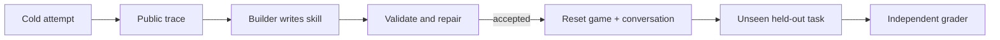

# noob-agent

noob-agent tests whether an AI model can learn a new game mechanic and turn
what it learned into a small, reusable Python program.

The model starts with a short list of ordinary actions. It explores a task it
has not been told how to solve, records what happened, writes a Python function
from that experience, checks the function, and tries it on a fresh version of
the task.

> Given the same actions, feedback, and budget, can a model turn experience
> into code that works in a new situation?

This is an evaluation harness, not a general-purpose game-playing bot. It
does not fine-tune or change model weights.

## What is working

The repository contains the shared learning loop, Minecraft and Doom
connectors, persistent run records, skill validation, and deterministic tests.
The project is still a hackathon prototype, so the evidence is mixed:

- The fake-connector tests and connector plumbing cover the full learning loop.
- A hand-written fixture skill is accepted and reused in deterministic Doom
  tests. That fixture is test plumbing, not a model result.
- The recorded Doom model run did not produce an accepted skill. The model
  exhausted its action budget without killing the target, and the Builder
  reply was cut off at its output limit.
- The live Minecraft clean-versus-faulty grading path and independent defect
  reproduction are not yet complete.

The repository can support a first technical phase and a credible prototype
review. It should not claim that the complete cross-game benchmark is finished.

## The loop

The Action agent plays through a connector and records every observation,
decision, primitive action, result, model call, and cost. The Builder then uses
the public training trace to write a Python skill. Skills are validated in an
isolated environment before an immutable version can be offered on a fresh
held-out episode.



The only thing carried across the reset is the accepted skill. Held-out grader
feedback never goes back to the Builder, and the prompts, primitive controls,
scenario split, and budgets stay fixed.

## What the comparison means

- **Cold:** primitive actions only.
- **Self-improving:** the same actions and budget, plus an accepted skill built
  from training evidence.
- **Notes control:** the same evidence and learning budget, but written notes
  instead of executable code.

The scorecard keeps task completion, exploration, skill acceptance, transfer,
defect reproduction, action counts, model calls, tokens, time, and dollars
separate. SQLite is the source of truth. Weave mirrors the durable run trace.

## Terms used in this repository

- **Action agent:** the model that chooses what to do in the game.
- **Builder agent:** the model call that turns a public training trace into a
  candidate Python skill or repairs a rejected candidate.
- **Primitive:** one low-level game action, such as `observe`, `move`, `attack`,
  or `use_object`.
- **Connector:** the adapter that translates the shared action format into one
  game's controls and returns structured observations and results.
- **Skill:** a generated Python function that calls approved primitives to
  perform a repeated task. Accepted skills are versioned and immutable.
- **Training episode:** the first attempt, where the model explores and leaves
  evidence for the Builder.
- **Held-out episode:** a fresh task variation the Builder did not see. It
  tests transfer rather than memory of the original run.
- **Independent grader:** code outside the model conversation that checks the
  actual game outcome.
- **Defect reproduction:** a fresh reset that replays evidence for a reported
  bug to check whether the bug is real and repeatable.
- **Scenario:** a declared task with its rules, reset behavior, budgets, and
  training or held-out variations.
- **Seed:** a fixed number that makes a scenario reset reproducible.
- **BDP:** "Basic Demoable Product," the smallest vertical slice in
  [`hackathon_plan.md`](hackathon_plan.md). It is the project's first complete
  demonstration target.
- **Weave:** W&B's tracing and evaluation product. Here it mirrors local run
  records so a person can inspect model calls and episode steps.
- **W&B Inference:** the model-serving interface used by the configured client.
- **SQLite:** the local database that stores experiments, episodes, steps,
  model calls, skills, and grading records.
- **CoreWeave Sandbox:** the intended isolated runtime for generated skills.
  The local subprocess fallback is weaker and is labeled as such.
- **ViZDoom:** the Python Doom environment used by the second connector.
- **Mineflayer:** the Node.js library used to connect to Minecraft.
- **Sidecar:** the helper process that runs Mineflayer and exchanges
  newline-delimited JSON messages with Python.
- **JSON Lines:** a text format with one JSON object per line, used by that
  Python-to-Node connection.
- **Data pack:** Minecraft files that add commands and game behavior without a
  custom mod.
- **Action space:** the complete set of actions available to the model in one
  environment.
- **Trace:** the chronological record of observations, model decisions, game
  results, and costs for an episode.

## A Doom result

The checked-in image is a non-benchmark Doom replay capture. It shows the
intended cold-versus-skill presentation, not a published aggregate result.


*Non-benchmark demo capture from the Doom comparison recorder. It is a visual
example of the intended cold-vs-skill story, not a published aggregate score.*

Doom is connected through [ViZDoom](https://vizdoom.farama.org/) with
structured observations and a frozen set of ordinary player controls. The
replay viewer can verify recorded episodes step by step; see
[`docs/doom-env.md`](docs/doom-env.md).

## Two different games

- **Minecraft** (primary): a local vanilla Java 1.21.1 server, an unfamiliar
  data-pack mechanic, and a Mineflayer connector. See
  [`docs/minecraft-server.md`](docs/minecraft-server.md).
- **Doom:** fast, real-time, Python-native, and resettable through ViZDoom. See
  [`docs/doom-env.md`](docs/doom-env.md).

Two integrations do not prove that every game will work. Generality remains a
hypothesis for future testing.

## Repository map

```text
src/noob_agent/
  agents/          Action and Builder model roles
  connectors/      Minecraft, Doom, and fake game adapters
  domain/          Typed records and public contracts
  grading/         Independent outcome checks and reproduction
  models/          Model client and call recording
  observability/   Weave trace mirror
  prompts/         Action and Builder prompts
  runtime/         Episode and learning-sequence orchestration
  skills/          Skill packages, policy, registry, and execution
  storage/         SQLite schema and repository
  verification/    Skill validation

scenarios/         Versioned game scenarios and seeds
scripts/           Demo, replay, and smoke-run entry points
tests/             Unit, integration, and live-environment contract tests
docs/              Operational guides and dated implementation status
assets/            Checked-in visual evidence
```

The contracts and scope live in:

- [`hackathon_plan.md`](hackathon_plan.md): authoritative scope and build order
- [`connector_contract.md`](connector_contract.md): observations, primitives, and accounting
- [`skill_contract.md`](skill_contract.md): generated skills, permissions, and validation
- [`minecraft_scenario.md`](minecraft_scenario.md): task, worlds, and private grading
- [`eval_protocol.md`](eval_protocol.md): conditions, budgets, metrics, and publication rules
- [`docs/current-status.md`](docs/current-status.md): dated implementation status

## Getting started

Requires Python 3.11+ and [uv](https://docs.astral.sh/uv/).

```sh
uv sync --group dev
uv run pytest
```

Copy `.env.example` to `.env` and fill in only the credentials for integrations
you enable. All integrations are disabled by default, and tests do not need
credentials.

```sh
# Run one Doom learning sequence: cold training, Builder, held-out grading.
NOOB_AGENT_SANDBOX_MODE=local uv run --env-file .env python \
  scripts/run_doom_learning_sequence.py

# Watch a previously recorded Doom episode, checking every step.
uv run python scripts/replay_doom_episode.py \
  --database .noob-agent/doom-learning-live.sqlite3
```

`NOOB_AGENT_SANDBOX_MODE=local` uses a labeled local subprocess executor,
weaker isolation than CoreWeave Sandbox. This prototype makes no production
security claim for arbitrary generated code.

## Contributing

See [`AGENTS.md`](AGENTS.md). Work on feature branches, open pull requests into
`main`, stage one file per commit, and add a `CHANGELOG.md` entry for every
change.
