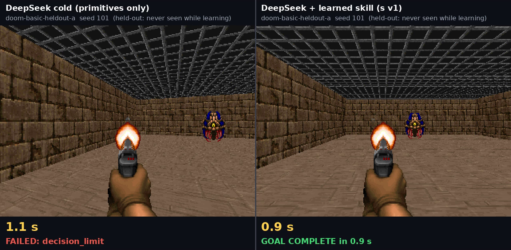
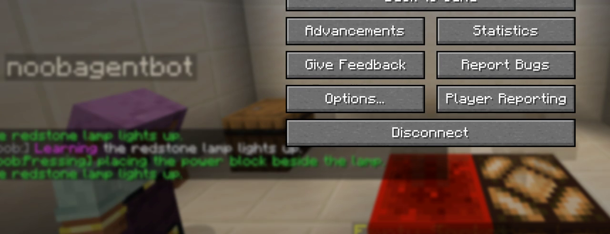
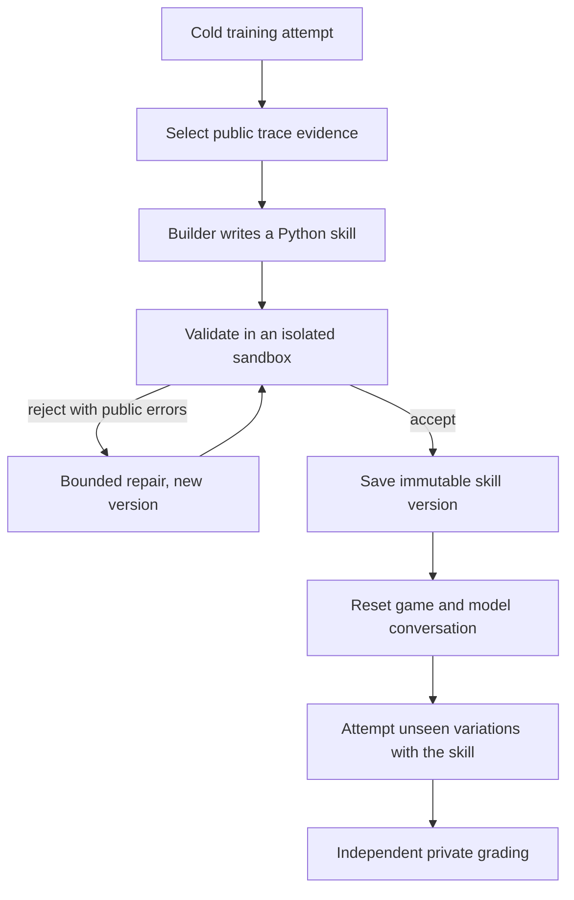

# noob-agent

## Current direction: Minecraft redstone computer demo

The planned headline demo is an agent that designs and constructs a programmable
4-bit redstone machine in a fixed flat creative world. A planner model chooses
the circuit and bounded build intentions; Jev executes and reports what happened.
The planner checks each module and can revise its design. Each attempt starts a
fresh model conversation. Benchmarking and post-training are deferred until the
demo works. See [`hackathon_plan.md`](hackathon_plan.md) for the scoped design.

The old Minecraft learning-demo runners have been removed, including their
Builder/repair/reuse orchestration and diagnostic token overrides. There is no
replacement redstone-computer demo command yet; Jev and custom-mod integration
are not implemented. The Minecraft connector, episode runner, storage, model-call
accounting, Weave tracing, and scenario fixtures remain as the foundation.

Generated skills, multi-round refinement, defect reproduction, and Doom remain
in the repository as legacy experiments, not requirements for the new product.
The sections below describe that historical prototype and its recorded results.
The retained Doom commands still exercise that prototype. See the current scope
at the top of [`hackathon_plan.md`](hackathon_plan.md).

Run retained checks with `uv run pytest`, lint with
`uv run ruff check src tests scripts`, and type-check with `uv run mypy src`.

### Astra build controller

Milestone 0 has a partial JavaScript controller (no npm dependencies; Linux Bubblewrap required) for the staged build in
[`hackathon_plan.md`](hackathon_plan.md). It calls the installed Codex CLI with
`gpt-6-astra`. Complete the enforcement gaps below before launching real work.
Run the local controller checks first:

```sh
node --test tests/astra_controller.test.mjs
```

These are the controller's real-run commands, not a fake-agent smoke check:

```sh
node scripts/astra_controller.mjs init
node scripts/astra_controller.mjs status
node scripts/astra_controller.mjs step
```

`step` launches one coordinator, worker, or reviewer agent according to the
durable state. `run` continues steps until paused or complete; use it only after
checking the current plan and budget. Workers run with the host user's full shell
and filesystem permissions, including creation and edits outside their assigned
files. Coordinators and reviewers still run inside read-only Bubblewrap.
Each process gets a disposable runtime folder for CLI output and a fresh Codex
home; authentication is linked read-only. Worker assignments are review scope,
not a write boundary. The controller records JSONL
traces, handoffs, review results, file assignments, and a credit ledger in
`.noob-agent/astra-controller/` (ignored by Git). It refuses to relaunch a
pending call after interruption. `recover` requires an exit receipt and a single
completed turn with valid usage at the end of its trace; otherwise inspect the pending artifacts before deciding how to
proceed. Do not delete the state file to bypass a pending run.

The CLI adapter is retained to avoid adding dependencies during this bounded
repair. Local `codex --version` reported 0.155.1; `exec --help` and
`exec resume --help` confirmed JSONL and structured-output flags. The supported
[JavaScript/TypeScript SDK](https://developers.openai.com/codex/sdk) provides
`Codex`, `startThread()`, `thread.run()`, and `resumeThread(id)`; it is not installed
here. The documented [CLI event format](https://developers.openai.com/codex/noninteractive)
uses `thread.started.thread_id` and `turn.completed.usage` with `input_tokens`,
`cached_input_tokens`, `output_tokens`, and `reasoning_output_tokens`. The parser
uses the first three usage fields and tolerates additional fields. These are
token usage fields, not billed credits or an active-context percentage. Verification
used documentation, local CLI help, and fake JSONL. The sandbox flags were also
checked against local Bubblewrap 0.9.0 help and exercised with fake executables.
Explicit `sandbox_mode` and `approval_policy=never` overrides use the documented
[CLI configuration interface](https://developers.openai.com/codex/config-reference).
The CLI's inner sandbox is set to `danger-full-access` for workers, which run
directly as the host user. Read-only Bubblewrap remains the write boundary for
coordinators and reviewers. The worker has the same filesystem and network reach
as this user, including controller artifacts and Git metadata. Saved thread IDs
are deliberately not resumed: all roles start a
fresh conversation with their explicit policy and durable handoff. This also
avoids inheriting old permissions. No billing or context percentage is inferred
from these controls.

Reviews now save `review-baseline.json` and `review-evidence.json` alongside
`acceptance-gate.txt`. A SHA-256 fingerprint covers Git-listed tracked and
nonignored untracked files (including modes and symlink targets), plus the plan.
It excludes `.noob-agent/`, Git metadata, and ignored dependencies/artifacts.
The controller checks this fingerprint after review, after tests, and before
acceptance, including recovery. Changes invalidate the gate or pause acceptance;
old receipts without fingerprints require a fresh review. Accepted history keeps
the fingerprint and receipt path. This checks content at boundaries; it does not
isolate tests from concurrent edits or freeze ignored dependencies. A change that
is reverted between checks is not detected.

While `step` runs, use a second terminal to watch its current trace:

```sh
node scripts/astra_controller.mjs status
tail -f .noob-agent/astra-controller/runs/<run-id>/events.jsonl
```

Read the `pending.tracePath` value in `status` for the exact trace path. The
trace is machine-readable JSONL; `status` shows a concise state after the step
finishes. `resume-decision` applies a saved coordinator decision after an old
allowance overrun without launching that agent again; it refuses other pauses.
After actual billed usage is reconciled, `resume-overrun` returns a completed
worker overrun to the coordinator without refunding its section usage or
repeating the worker call. This is a migration command for pauses recorded under
the former per-worker cap; the coordinator can continue while milestone and
global budgets fit.

Credit charges derived from CLI token usage are estimates. Worker call estimates
guide dispatch and monitoring; exceeding one does not pause the controller.
Milestone pools and the 2,000-credit global ceiling are the spending gates.
Compare the ledger with actual account billing and record the billed total with
`node scripts/astra_controller.mjs reconcile CREDITS` before a long run. The
value is the total credits actually billed to your account for this controller
run; enter `0` while included plan usage covers all its calls. After
reconciliation, the global ceiling uses that billed total plus estimated usage
from later calls until the next reconciliation. The reconciliation allocates
the billed total across milestone pools and the active work section in proportion
to their token estimates. Each original estimate stays in the run history; the
per-call billed split remains an estimate because the CLI does not report it.
For a checkpoint recorded before this allocation was implemented, run
`attribute-reconcile` once. It leaves usage from later calls as estimates.
`resume-reconciled` can then return a budget pause to the coordinator when the
reconciled limits fit. Neither command launches a model call.
The controller reserves a 25-credit margin and pauses on missing usage or a
milestone/global budget overrun. Milestone 0 has a controller-run test gate; later milestones require
their live Minecraft acceptance checks to be defined and verified before they
can be treated as complete.

Context checkpoints now mean one invocation per fresh conversation, plus a
64-KiB UTF-8 prompt ceiling checked before pending dispatch is saved. The same
milestone pool and spent balance survive the checkpoint. This is a conservative
chunk/input-size policy, not a measured 50% context threshold; tool output and
internal model turns can still grow during an invocation.

Each CLI invocation also has a five-minute runtime checkpoint. When it is
reached, the controller waits for the active tool item to finish before stopping
the process; a tool that hangs for another minute is stopped. An interrupted
call leaves its pending state and partial trace for inspection. Its billed usage
must be checked with the account dashboard before deciding how to recover it.
This time bound cannot guarantee a credit ceiling within a call.

Captured stdout and stderr share an 8-MiB byte ceiling per invocation. Overflow
immediately kills the confined process, including when a tool item is active;
the trace may end mid-record. Capped artifacts, repository edits, and pending
state remain inspectable. Dispatch remains blocked while that pending run lacks
a recoverable response and usage receipt. This limits captured stream bytes,
not model tokens, internal turns, or billed credits.

Response files have a separate 1-MiB acceptance/read ceiling, checked on the
opened regular file before parsing at completion and during recovery. Reads use
a fixed-size buffer plus a one-byte overflow probe, so file growth cannot cause
an unbounded read. Final-component symlinks and non-regular files are refused.
Oversized successful-process output leaves a capped `response.json.partial`
beside the trace; it is inspection evidence only, never a recoverable response.
Pending state and edits remain intact, and redispatch stays blocked. Oversized
durable responses encountered during recovery remain unchanged. This bounds
controller response reads, not bytes the process can write to temporary disk
while running; it does not resolve interrupted usage accounting.

Read-only observer confinement requires Linux with working Bubblewrap/user
namespaces and fails closed if Bubblewrap cannot start. Workers now run directly
as the host user. The installed CLI's local-provider fixture verifies that a
worker can execute a shell command and edit assigned and unassigned files.
The controller cannot protect its ledger or unrelated host files from a worker
with these permissions. This is a trusted-worker arrangement, not an isolation
boundary for worker code. Authenticated external-provider compatibility remains
unverified.
Completed and interrupted worker changes are accumulated across the milestone
for independent review. If an interrupted run has no usable pre-run baseline,
the controller marks the scope unknown and blocks milestone acceptance. The
assignment list guides the work but does not pause a worker for a needed edit
outside that list.
The post-recovery full controller suite passed **82/82** with the installed CLI;
its TAP output is saved at
`.noob-agent/astra-controller/verification/milestone-0-full-permissions-recovery-20260922T1928.tap`.

Recovery now records Linux PID, boot ID, and process start ticks for lock owners
and observed worker launchers. `recover` reclaims a lock only when its owner is
provably gone or its PID has been reused; live, unreadable, and legacy empty
locks remain blocked. A shared acquisition guard serializes reclaim against
other controllers, and reclaimed lock files are retained as `.lock.stale.*`.
A crash while holding `.lock.guard` requires manual inspection; it is never
automatically removed by another controller.

Worker launch/exit receipts block recovery while launch is uncertain or a worker
may still be live, even with complete response artifacts. A dead launcher alone
does not authorize recovery without an exit receipt. Injected in-process test
runners use a separate completion receipt; they are trusted test adapters.
Missing, ambiguous, or unfinished usage evidence keeps pending state unchanged.
If a confirmed exit has valid usage but no response, recovery records the token
estimate once in the original pool and worker section, atomically with a pending
receipt. It remains paused and cannot dispatch or replay a later response.
Repeated recovery does not charge again. Partial/oversized response artifacts
remain inspection-only. State and receipt writes sync the file and parent
directory around atomic replacement. These are fake-result/process tests, not
proof of real CLI sandbox recovery or account billing accuracy.

After inspecting a usage-only interrupted **worker**, run `recover` to record
its usage, then `node scripts/astra_controller.mjs continue-usage RUN_ID` to
return to the coordinator. Continuation requires the exact pending run, an
`exited` process receipt, no response or partial-response artifact, one valid
terminal usage event, and one matching interrupted ledger charge. It preserves
all artifacts and the original pending metadata in history, retains section
spending, and clears old worker results, review evidence, and worker thread ID.
Repeated recovery/continuation cannot charge the call again; repeating a
completed continuation leaves newer work untouched. Missing or ambiguous
evidence retains pending dispatch blocking. Budget overruns remain paused;
the next dispatch still checks its estimate and the global safety margin.
This path supports workers only and does not reconstruct a missing result.

Verification for this bounded chunk (2026-09-22): the new success-path behavior
first failed with `continueInterruptedUsage is not a function`. The final
`node --test tests/astra_controller.test.mjs` passed **77/77**, with zero failures,
skips, or cancellations. Three added tests cover repeated recovery/continuation,
artifact preservation, stale-result invalidation, later fake dispatch without
duplicate charges, refusal for live/unknown/missing exit evidence and missing,
changed or duplicate usage/ledger evidence, and retained budget gates. The
`git diff --check` whitespace check passed (exit 0). The
preserved trace at `.noob-agent/astra-controller/runs/12552a9e-48de-477c-8ec1-3da729139434/events.jsonl`
was inspected; its last recorded test command reported 69/69 passing. The
continuation tests used fake processes and did not invoke Minecraft or OBS.
The Astra worker call itself was real and was charged by the controller's
token estimate; actual billed usage remains unavailable.

For a legacy worker interrupted before exit and usage receipts existed,
`retire-interrupted RUN_ID BILLED_TOTAL --observed-exit` is a manual recovery
path. Use it only after observing that the CLI process exited and reading the
total credits actually billed for all controller calls. It requires the exact
pending run ID, refuses a response or completed usage receipt, retains the
trace, and reconciles the reported total across existing pool receipts. It
invalidates the old worker result and review, then returns control to the
coordinator for a fresh worker. This proportional pool attribution requires
prior usage in the pending milestone; it cannot identify the interrupted call's
individual cost. A resulting budget overrun remains paused.

When account billing is delayed, `retire-provisional RUN_ID RESERVE_CREDITS --observed-exit`
can instead reserve a conservative estimate from the
unallocated reserve, record it as provisional usage in the interrupted
milestone, and return to coordination. The billed total is left unchanged; the
ledger must be reconciled when the account reports the charge. This command
uses the same exact-run, exit, response, and trace checks and preserves the
original artifacts. Choose the estimate with enough room for the next bounded
call; it is an accounting reserve, not a claim about actual billing.
If the reserve is exhausted, append `--from=N` after `--observed-exit` to
transfer from an unused future milestone pool N. The transfer and provisional
usage are both recorded; N must be greater than the active milestone.
When an idle coordinator cannot dispatch because its milestone pool lacks the
25-credit planning estimate, `transfer-pool N CREDITS "reason"` records an
operator transfer from a future milestone N. It applies the same future-pool
validation as a coordinator transfer and is refused while a call is pending.

The CLI response file is now checked every 50 ms while the process runs. If it
exceeds 1 MiB, the controller stops the process and keeps a bounded partial
copy. This promptly limits observed growth but is not an atomic disk quota; a
rapid write can overshoot between checks.

Remaining milestone-0 work: independently review the disclosed uncapped internal
model requests and the continuation and recovery paths, as the plan permits.
Runtime/output
checkpoints do not bound model calls inside a turn. A
failed sandbox launch can still leave pending state for inspection. The review
fingerprint/recovery gates remain unchanged. Active controller state was not
modified in this repair. An initial test fixture accidentally invoked the installed
CLI before PATH interception was fixed; those calls exited with errors. No usage
receipt is available for those attempts, so neither zero usage nor zero billing
is claimed. Those earlier checks used temporary fake-agent fixtures.

Milestone-0 continuation evidence (2026-09-22): installed `codex --version`
reported **0.155.1**. Inspection of `codex exec --help`, `codex --help`, and the
[official configuration reference](https://developers.openai.com/codex/config-reference)
did not establish a supported internal model-turn limit. The
[documented JSONL events](https://developers.openai.com/codex/noninteractive)
describe a whole agent turn; counting `turn.completed` does not bound the model
requests inside its tool loop. `codexRunner({maxModelTurns: 1, ...})` now fails
before creating artifacts or launching a process. Any non-null requested limit
is unsupported. This guard prevents silently ignoring that API option; it does
**not** add enforcement to normal dispatch, which still defaults to no model-turn
bound. No acceptance or review gate was relaxed.

The added offline real-CLI checks are opt-in and reproducible:

```sh
ASTRA_REAL_CODEX="$(command -v codex)" node --test tests/astra_controller.test.mjs
```

`ASTRA_REAL_CODEX` must name an absolute installed executable. The tests use
temporary repositories and ledgers. The startup-failure fixture uses Bubblewrap
and a network namespace; the worker fixture uses a local Responses provider.
One selects a nonexistent provider and verifies that startup failure preserves
pending state and blocks redispatch. The other serves deterministic Responses
locally: the installed CLI executes a shell command, edits both assigned and
unassigned files, and emits usage. The fixture removes its response after exit; recovery
charges that usage once and keeps the original artifacts pending. Neither test
contacts an external model backend or establishes account billing.

The turn-limit regression first failed with `Missing expected rejection` before
implementation. Focused checks passed **2/2**; the full command above was rerun
for full milestone-0 review and passed **84/84**, with zero failures,
cancellations, or skips.
The TAP output is preserved at
`.noob-agent/astra-controller/verification/milestone-0-full-review-20260922T1653.tap`.
Without the environment
variable the two real-CLI checks are explicitly skipped. An initial offline fixture
failed because its nested Bubblewrap namespace lacked a root mount; adding that
mount allowed the real CLI to run. A subsequent nested-shell fixture failed with
`Failed to create unified exec process: Permission denied (os error 13)`.
The passing fixture uses native `apply_patch`, so it proves patch confinement
and usage-bearing recovery after a simulated lost response, not shell execution.
The interrupted trace preserves the failed shell and passing patch checks at
`.noob-agent/astra-controller/runs/f9075462-19c8-4ae6-876a-4651f6c04893/events.jsonl`.
The full-scope reviewer also found that coordinator dispatch charged milestone 0
after advancement. The controller now charges the active milestone, with a
regression test that exhausts milestone 0 before dispatching milestone 1.
An additional local-provider probe tried the CLI's documented external-sandbox
bypass flag inside Bubblewrap. Under that flag, Codex returned the fixture's
final response without executing its tool call, so the flag was reverted.
That nested-shell limitation applied to the former worker sandbox. Workers now
run directly with full host permissions; the local-provider shell and patch
fixture passes under that design.
After reverting that probe, the full installed-CLI controller suite passed
**85/85** with no skips. The saved output is
`.noob-agent/astra-controller/verification/milestone-0-post-review-fixes-20260922T1703.tap`.

Handoff: the installed CLI offers no verified pre-request model-call limit.
The controller uses fresh sessions, a 64-KiB prompt ceiling, and a five-minute
runtime checkpoint, so the plan's 50% context handoff remains an estimate.
Independent review must decide whether that limitation is acceptable for
milestone 0; it must not claim an internal turn limit. Keep exit confirmation,
exactly-once charging, usage-only continuation, and review invalidation gates.
The live controller state was not changed by these isolated tests. Actual billed
usage remains unavailable.

Milestone-0 review now includes the controller, its tests, and the plan even
when the last worker changed only documentation. If a recorded review covered
only documentation, `invalidate-review "reason"` clears that review under the
controller lock and records why; the coordinator can then dispatch a full
read-only review. Acceptance still requires the new review and test gate.

Manual fake-controller smoke check (no credentials, OBS, or Minecraft needed):
run this command from the repository and inspect the named results. Fixtures
create temporary Git repositories and state; they never run the real Codex CLI.

```sh
node --test --test-isolation=none --test-name-pattern='fake coordinator|confinement|checkpoint|acceptance refuses|changes during|recovery refuses|unchanged review recovery|legacy recovered|recovered accepting' tests/astra_controller.test.mjs
```

Expect dispatch through coordinator/worker/reviewer and acceptance for unchanged
content; refusal after edits, additions, deletions, modes, symlinks, or plan changes;
invalidation during review/tests; recovery without duplicate charges; worker
shell and unassigned writes; and
read-only observer policies even when saved thread IDs exist. This is
controller evidence only, not milestone-0 completion or Minecraft verification.

### Record a Minecraft attempt with OBS

On this WSL2/Windows machine, launch Minecraft Java 1.21.1 through TLauncher and
leave its game window open. Start Windows OBS Studio. From the repository root:

```sh
node scripts/record_minecraft.mjs setup
node scripts/record_minecraft.mjs start --run-id trial-001
# Run the attempt, including its outcome.
node scripts/record_minecraft.mjs stop --run-id trial-001
```

`setup` selects the dedicated `Minecraft Demo` scene and binds `Minecraft Window`
to the running Java game window. `start` restores Minecraft if it is minimized.
Keep the game window open and unminimized throughout the recording. Press F5 in
Minecraft to use a third-person camera if desired. The script refuses reused run
IDs and requires password-protected OBS WebSocket, OBS's MKV recording format,
Node.js 22+, `powershell.exe`, `wslpath`, `ip`, and `ffmpeg`. It adds no package
dependencies.

Every run writes `.noob-agent/recordings/<run-id>/manifest.json`, the original
MKV, and a playable `recording.mp4`. The directory is ignored by Git. If a run
is interrupted, preserve its original MKV. A prior run's files are never
overwritten. Check the recorder tests with
`node --test tests/minecraft_obs_recorder.test.mjs`.

## Historical learning prototype

noob-agent measures how well an AI model **learns** inside a game it has never
seen. It doesn't just check whether the model can finish a fixed task.

A model starts as a "noob": it gets the same basic new-player senses and
controls as every other model (observe, move, inspect, pick up, interact). Nobody
tells it how the unfamiliar objects work or what steps reach the goal. It has to
experiment, turn what it discovers into reusable Python **skills**, and then use
those skills on variations it never saw while learning.

The central question:

> Given the same new-player controls, unfamiliar environment, feedback, and
> learning budget, how effectively can a model turn experience into a reliable
> skill that works on unseen variations?

Self-improvement here means building and keeping tested code. It does **not**
mean fine-tuning or changing model weights.

## What it looks like

**Doom:** the same model on a held-out seed it never saw while learning. On the
left it has primitives only; on the right it also has a skill it wrote and
validated from its own training attempt.



**Minecraft:** the redstone lamp exercise. The bot (`noobagentbot`) takes a
redstone block from a barrel and places it beside the lamp. Its in-game chat
narrates each step (`Seeing`, `Doing`, `Pressing`, `Learning`), and the lamp
lights once Minecraft reports it powered. This frame comes from a demo
recording of the exercise. It is not a graded model result; see
[What is working today](#what-is-working-today) for the recorded model run.



Want to try it with your own W&B account? See
[Run the demo yourself](#run-the-demo-yourself).

## What is working today

This is a hackathon prototype, not a finished benchmark. The shared learning
loop, Minecraft and Doom connectors, persistent run records, skill validation,
Weave tracing, and deterministic tests are in the repository. All live numbers
below come from `deepseek-ai/DeepSeek-V4-Flash-0731` on W&B Inference, with
skills run in the labeled local subprocess. Full scorecards are in
[`docs/loop-optimization.md`](docs/loop-optimization.md).

**Doom: the model now learns skills reliably, but transfer is uneven.**

- After the loop fixes in plan sections 22–24, the model wrote a skill that
  passed validation in 5 of 5 benchmark sequences, up from 1 of 5. None of 597
  Action replies were unusable, and no sequence exceeded a protocol ceiling.
  Before these fixes, about half of Action replies were cut off at their token
  cap.
- Held-out success (`loop-bench-24b-r2`): 8 of 30 goals. The best sequence
  solved all 4 practice seeds and 5 of 6 held-out cells. The other four solved
  0 or 1 of 6 each.
- Practice scores agreed with the private grader on every episode, so practice
  is a trustworthy signal for keeping or dropping a skill version.
- Multi-round refinement runs, but it has not improved held-out results yet.
  The two refinements kept only used fewer primitives. Three of 5 sequences
  stopped on the 140-call learning budget after one refinement round.
- The Doom comparison image above is one demo recording on one held-out seed.
  Skill quality varies between learning sequences, so a rerun can differ.

**Minecraft: the Action loop works live, but the full learning loop is not
proven yet.**

- On the live server, a cold training episode had 0 of 10 unusable replies and
  a 690 ms median decision.
- In the recorded redstone lamp run (`minecraft-redstone-20260913T191654Z`),
  the cold attempt lit the lamp in 9 decisions, including one rejected block
  placement. The Builder's reply was unusable, so no skill was learned and
  there was no skill-reuse attempt. A second run ran out of decisions without
  lighting the lamp and then timed out.
- Minecraft observations are large. A 20-decision training episode used 43,752
  tokens, over the 40,000-token ceiling. PR #68 cuts the observation size but
  has not met its target.
- The Resonator clean-versus-faulty grading path and independent defect
  reproduction are not complete.

**Not yet built:** the CoreWeave Sandbox executor; so far skills run only in
the local subprocess.

The repo supports a credible prototype review. It should not claim that the
full cross-game benchmark is finished.

## How it works

Two loops run at different speeds.

**Fast action loop.** The Action agent repeatedly observes the public game state,
chooses one primitive action or accepted skill, executes it through a game
connector, and records the result. An attempt ends on success, a budget limit, no
progress, or an infrastructure failure.

**Slow improvement loop.**


```mermaid
flowchart TD
    Cold[Cold training attempt] --> Trace[Select public trace evidence]
    Trace --> Candidate[Builder writes a Python skill]
    Candidate --> Validate[Validate in an isolated sandbox]
    Validate -->|reject with public errors| Repair[Bounded repair, new version]
    Repair --> Validate
    Validate -->|accept| Save[Save immutable skill version]
    Save --> Reset[Reset game and model conversation]
    Reset --> Heldout[Attempt unseen variations with the skill]
    Heldout --> Grade[Independent private grading]
```

The accepted skill is the only thing carried across the reset. Held-out grader
feedback never goes back to the Builder, and the connector, grader, scenario
split, budgets, and prompts stay fixed, so the system can't raise its score by
editing the test.

## What it compares

- **Cold condition:** primitive tools only.
- **Self-improving condition:** same tools and budget, plus skills the model
  built and validated from its own training attempts.
- **Notes control:** same evidence and learning budget, but it keeps a written
  playbook instead of executable code. This checks whether validated skills add
  value beyond reflection.

Results are a small scorecard, not one opaque number. It separates initial
ability, skill-building, repair, transfer to unseen variations, defect discovery
and reproduction (clean vs. faulty scenario twins), and cost in actions, model
calls, tokens, time, and dollars. Every step is recorded in SQLite and mirrored
to W&B Weave for inspection.

## How we used W&B Weave, the sandbox, and traces

**Traces are the record of every run.** SQLite is the source of truth. After
each event is safely written there, `WeaveTraceSink`
([`src/noob_agent/observability/tracing.py`](src/noob_agent/observability/tracing.py))
mirrors it to W&B Weave as a nested call tree:

- `noob_agent.episode`: one call per training, practice, or held-out attempt.
- `noob_agent.step`: one child call per recorded step, holding the Action
  agent's subgoal, expected evidence, chosen action, arguments, result,
  latency, and tokens.
- `noob_agent.model_call`: every model call. Action calls nest under their
  episode. Builder and refinement calls sit at the top level, since no episode
  is open while they run.

Tracing is best effort. A slow or unreachable Weave backend can never change a
recorded attempt. Concurrent held-out cells keep their own call trees, and
tracing is flushed once after all cells finish.

**Weave is also what we read from, not only what we write to.**

- [`scripts/live_reasoning_view.py`](scripts/live_reasoning_view.py) polls
  Weave (never SQLite) for one run's calls and serves a local page beside the
  game. The page shows each decision's reasoning and result, the Builder's
  generated code, episode outcomes, and a link to every call in Weave. In a
  live demo, decisions appeared a median 2.0 s after the model replied.
- [`scripts/doom_demo_log.py`](scripts/doom_demo_log.py) builds the Doom demo
  transcript from Weave calls.
- Model calls go through W&B Inference with the same `WANDB_API_KEY`.
  Traces are how we debugged the loop. For example, they showed Action replies
  that could not be parsed, a Builder reply cut off at its output cap, and a
  Weave flush that deadlocked concurrent episodes. See
  [`docs/loop-optimization.md`](docs/loop-optimization.md).

**Sandbox: generated skills never run in the agent process.** A skill starts as
untrusted, model-written Python. It goes through these checks:

1. A static policy check parses the source with `ast` without running it, and
   rejects forbidden imports and builtins
   ([`src/noob_agent/skills/policy.py`](src/noob_agent/skills/policy.py)).
2. The validator runs the candidate through replay, negative-case, and
   variation phases in the configured executor. Only an accepted version is
   saved, and saved versions are immutable.
3. At run time the skill executes in a separate worker process
   ([`src/noob_agent/skills/worker.py`](src/noob_agent/skills/worker.py)).
   The worker loads it with guarded builtins and imports, and the skill can
   only reach the game through a narrow `SkillContext` (`observe`, `call`,
   `remaining_budget`, `log`) relayed as JSON Lines. It is time-limited, and
   every primitive it uses counts against the same action budget.

The executor interface is designed for CoreWeave Sandbox
(`NOOB_AGENT_SANDBOX_MODE=serverless` or `cks`), but that backend is not
implemented yet. Asking for it fails loudly rather than quietly falling back.
Every recorded run so far used `NOOB_AGENT_SANDBOX_MODE=local`, the restricted
local subprocess. Each of its results is labeled `local-subprocess` so a report
cannot mistake it for a sandbox run. It enforces no network or memory limit.

## Terms used in this repository

- **Action agent:** the model that chooses what to do in the game.
- **Builder agent:** the model call that writes a skill from a public training
  trace or repairs a rejected skill.
- **Primitive:** one low-level game action, such as `observe`, `move`, `attack`,
  or `use_object`.
- **Connector:** the adapter that translates the shared action format into one
  game's controls and returns structured observations and results.
- **Skill:** a generated Python function that calls approved primitives to do a
  repeated task. Accepted skills are versioned and immutable.
- **Training episode:** the first attempt, where the model explores and leaves
  evidence for the Builder.
- **Held-out episode:** a fresh task variation the Builder did not see. It
  tests transfer rather than memory of the original run.
- **Independent grader:** code outside the model conversation that checks the
  actual game outcome.
- **Defect reproduction:** a fresh reset that replays evidence for a reported
  bug to check whether the bug is real and repeatable.
- **Scenario:** a declared task with rules, reset behavior, budgets, and
  training or held-out variations.
- **Seed:** a fixed number that makes a scenario reset reproducible.
- **Weave:** W&B's tracing and evaluation product. Here it mirrors local run
  records so a person can inspect model calls and episode steps.
- **W&B Inference:** the model-serving interface used by the configured client.
- **SQLite:** the local database that stores experiments, episodes, steps,
  model calls, skills, and grading records.
- **CoreWeave Sandbox:** the intended isolated runtime for generated skills.
  The local subprocess fallback is weaker and is labeled as such.
- **ViZDoom:** the Python Doom environment used by the second connector.
- **Mineflayer:** the Node.js library used to connect to Minecraft.
- **Sidecar:** the helper process that runs Mineflayer and exchanges
  newline-delimited JSON messages with Python.
- **JSON Lines:** a text format with one JSON object per line, used by that
  Python-to-Node connection.
- **Data pack:** Minecraft files that add commands and game behavior without a
  custom mod.
- **BDP:** "Basic Demoable Product," the smallest complete demonstration
  target described in [`hackathon_plan.md`](hackathon_plan.md).

## Games

The same learning architecture runs on two deliberately different games. Each
game supplies a public goal, observations, reset, and a frozen primitive control
set.

- **Minecraft** (primary): a local vanilla Java 1.21.1 server, a data-pack
  scenario with an unfamiliar mechanic, and a Mineflayer connector. See
  [`docs/minecraft-server.md`](docs/minecraft-server.md).
- **Doom** via ViZDoom: fast, real-time, Python-native, and fully resettable. See
  [`docs/doom-env.md`](docs/doom-env.md).

Two working games do not prove universal support. Generality stays a hypothesis.

## Repository map

```text
src/noob_agent/
  agents/          Action and Builder model roles
  connectors/      Minecraft, Doom, and fake game adapters
  domain/          Typed records and public contracts
  grading/         Independent outcome checks and reproduction
  models/          Model client and call recording
  observability/   Weave trace mirror and scorecards
  prompts/         Action, Builder, and refinement prompts
  runtime/         Episode and improvement-loop orchestration
  skills/          Skill packages, policy, registry, and execution
  storage/         SQLite schema and repository
  verification/    Skill validation

scenarios/         Versioned game scenarios and seeds
scripts/           Demo, replay, benchmark, and live-view entry points
tests/             Unit, integration, and live-environment contract tests
docs/              Operational guides and implementation status
assets/            Checked-in visual evidence
```

Specifications:

- [`hackathon_plan.md`](hackathon_plan.md): authoritative scope and build order
- [`connector_contract.md`](connector_contract.md): observations, primitives, and action accounting
- [`skill_contract.md`](skill_contract.md): generated skills, permissions, and validation
- [`minecraft_scenario.md`](minecraft_scenario.md): the Minecraft task, worlds, and private grading
- [`eval_protocol.md`](eval_protocol.md): conditions, budgets, metrics, and publication rules
- [`docs/current-status.md`](docs/current-status.md) and [`docs/loop-optimization.md`](docs/loop-optimization.md): implementation status and loop scorecards

## Run the demo yourself

### 1. Install (once)

You need Python 3.11+, [uv](https://docs.astral.sh/uv/), and a
[W&B account](https://wandb.ai/). Model calls go through W&B Inference and are
billed to your account, and traces land in your own Weave project.

```sh
git clone https://github.com/NWelde/noob-agent.git
cd noob-agent
uv sync --group dev --group integrations
cp .env.demo.example .env
```

Open `.env` and fill in two values: `WANDB_API_KEY` (from
<https://wandb.ai/authorize>) and `NOOB_AGENT_INFERENCE_PROJECT` (your W&B
username or team, followed by `/noob-agent`). Everything else is already set.
To check the install without credentials, run `uv run pytest`.

On a fresh clone this currently reports 3 known failing tests, unrelated to
your install: `test_both_builder_prompts_document_the_real_skill_contract`,
`test_sequence_summary_is_written_once_and_round_trips`, and
`test_budget_mode_has_its_approved_defaults` (see
[`hackathon_plan.md`](hackathon_plan.md) section 26 for the tracked cause).
It also skips 2 Minecraft connector tests until the Node sidecar's
dependencies are installed, which `scripts/setup_minecraft_server.py` does
for you in step 3 below.

### 2. Doom: a full learning sequence (no game install needed)

ViZDoom installs with the Python packages. This runs one cold training attempt,
lets the Builder write and validate a skill, then plays unseen held-out
variations with that skill. Each attempt is graded independently:

```sh
uv run --env-file .env python scripts/run_doom_learning_sequence.py
```

To watch it, add `--live-demo --live-view`. A Doom window opens, and a live page
at <http://127.0.0.1:8765> shows each decision's reasoning read back from Weave.
On Linux this needs a desktop session (WSLg works on Windows).

```sh
uv run --env-file .env python scripts/run_doom_learning_sequence.py --live-demo --live-view
```

What you get:

- **A JSON summary** printed at the end: the training result, whether a skill
  was accepted, and each held-out grade.
- **Weave traces** at `https://wandb.ai/<your-entity>/noob-agent/weave`: one
  call tree per episode, with every step and model call.
- **A replay** of any recorded episode in a visible window, with no model calls.
  Use `.noob-agent/doom-live-demo.sqlite3` for `--live-demo` runs:

  ```sh
  uv run python scripts/replay_doom_episode.py --database .noob-agent/doom-learning.sqlite3
  uv run python scripts/replay_doom_episode.py --database .noob-agent/doom-learning.sqlite3 --episode-id <episode-id>
  ```

To benchmark the loop on fixed seeds and write a scorecard, run
`uv run --env-file .env python scripts/loop_bench.py run --sequences 5`.

Results vary between runs because the model writes a different skill each
time. See [What is working today](#what-is-working-today) for typical numbers.

### 3. Retained Minecraft fixtures (needs Java 21 and Node.js 22+)

Set up a local vanilla 1.21.1 server with every scenario data pack and the
connector's Mineflayer dependency. First read the
[Minecraft EULA](https://aka.ms/MinecraftEULA); passing `--accept-eula` confirms
you accept it.

```sh
uv run python scripts/setup_minecraft_server.py --accept-eula --player <your-minecraft-name>
```

Start the server in its own terminal, and wait for `Done`:

```sh
cd .noob-agent/minecraft-server && java -Xms1G -Xmx2G -jar server.jar nogui
```

The old cold/Builder/reuse demo command has been retired. These instructions
only prepare the retained server and fixtures; they do not launch an agent or
produce an evaluation result. To inspect the world, join `127.0.0.1:25566` from
a Minecraft Java 1.21.1 client using the player name passed to `--player`.
The server runs in offline mode on 127.0.0.1 only, so never expose it to a network.
Details are in
[`docs/redstone-demo.md`](docs/redstone-demo.md) and
[`docs/minecraft-server.md`](docs/minecraft-server.md).

### Notes

- Generated skills run in the labeled local subprocess
  (`NOOB_AGENT_SANDBOX_MODE=local`). It is weaker isolation than CoreWeave
  Sandbox: the code is time-limited and gets a narrow API, but this prototype
  makes no production security claim.
- The runner stops before starting if something is missing, such as the API
  key or the integration packages, and says what to fix.
- `.env.example` documents every setting, including those the demo doesn't use.

## Contributing

Milestone 2 redstone infrastructure now has a dedicated-server read-only
preflight: `.venv/bin/python scripts/run_redstone_trial.py --preflight` from the
repository root. It saves a unique manifest and exits 2 (incomplete); it does
not yet restore a template, attach the bot or run the module smoke. See
[repeatable trial status, exact checks and continuation](docs/redstone-trials.md).

See [`AGENTS.md`](AGENTS.md). Work on feature branches, open pull requests into
`main`, stage one file per commit, and add a `CHANGELOG.md` entry for every
change.


Milestone-2 attachment/readback evidence (still incomplete):

```sh
.venv/bin/python scripts/run_redstone_trial.py --observe
```

This attaches `noobagentbot` to the existing dedicated server at
`127.0.0.1:25567`, saves actual player and block observations in a unique manifest,
and exits 2. It does not establish reset readiness or module success. See
[redstone trial status and handoff](docs/redstone-trials.md) for live evidence,
focused checks and the remaining reset/action/smoke work.


### Milestone 2: verified reset and infrastructure smoke

Run `.venv/bin/python scripts/run_redstone_trial.py --smoke` against the existing
local dedicated server. It verifies a hashed baseline, constructs a bounded
lever/dust/lamp fixture, observes actual off/on/off states using normal lever
interaction, and verifies restoration to the same baseline. `--reset-check`
performs two verified restores with an intervening dirty block. Both print a
manifest path and exit **2** because recording is missing; neither claims model
success or milestone acceptance. Full finite-region scans, settings, exact
inventory and player pose were verified live. See
[trial evidence and remaining work](docs/redstone-trials.md#reset-and-bounded-action-continuation-2026-09-23-utc)
for exact artifacts, failed-run evidence, scope limitations and focused checks.

Milestone 3 planner/Jev adapters now have offline checks for bounded intentions,
fresh public planner context, exact Jev action selection, subprocess limits and
W&B requests with automatic retries disabled. They reuse the shared Jev handler;
the connected trial loop and fixture-driven live repair run are still pending.
See [the integration handoff](docs/redstone-trials.md#milestone-3-adapter-boundary-implementation-handoff).
Real-provider verification and milestone-6 recording remain pending.

Milestone 3 now has a tested `TrialLoop` connecting the planner and Jev adapters:
multiple validated choices per intention, observed results, repair feedback and
durable call/action/time limits. This is an offline implementation chunk; the
canonical fixture/provider trial command and dedicated-server repair proof are
still pending. See [the loop handoff](docs/redstone-trials.md#connected-loop-handoff).

### Milestone 3: explicit connected trials and live repair evidence

The canonical connected command is now:

```sh
.venv/bin/python scripts/run_redstone_trial.py --trial fixture
```

It runs against dedicated Minecraft ports **25567/25577**, verifies the initial
reset, builds a deliberately incomplete fixture, observes a failed powered-lamp
check, repairs the missing dust via a validated fixture Jev selection, observes
powered/off states directly, and verifies the final reset under one trial ID.
The recorded live proof passed these infrastructure checks; the failed check is
retained. This uses scripted fixtures, makes no external provider calls, prints
a manifest path and exits **2** with `model_success=false`.

Provider mode must be explicit: `--trial provider --planner-model MODEL_ID`,
optionally `--planner-project PROJECT`. Export `WANDB_API_KEY` and
`AI_GATEWAY_API_KEY` before that mode; Python's preflight does not load `.env`.
Missing credentials leave an incomplete manifest before world access, with no
fixture fallback. Public configuration is frozen without credentials. Provider
mode reuses W&B and the shared Jev handler, has no scripted layout/checker, and
currently runs to a declared limit; real-provider, full-machine and recording
verification remain pending. No provider command was executed in this work.

See [exact live evidence, checks and current handoff](docs/redstone-trials.md#canonical-connected-trial-continuation-2026-09-23-utc).
Earlier milestone-3 “command/live proof pending” paragraphs are historical.

Milestone 4 also supports read-only planner-declared interface inspection:
`uv run python scripts/run_redstone_trial.py --inspect-module declaration.json`.
It records actual probe/control readings and detailed rejection evidence, returns
exit 2, and cannot pass a module or machine. The four behavioral graders and
trusted timed controls remain pending. See [trial coverage and continuation](docs/redstone-trials.md#milestone-4-interface-foundation-checkpoint-2026-09-22).

Milestone 4 trusted control proof (dedicated world only):

```sh
uv run python scripts/run_redstone_trial.py --control-proof
```

This temporary lever/dust fixture verifies declared near/far controls and probes,
actual two-server-tick STEP evidence, failure handling and grading budget stop.
It prints a retained manifest and deliberately exits 2 (infrastructure only).
See [verified results and continuation API](docs/redstone-trials.md#milestone-4-trusted-control-continuation-2026-09-22).
Programming recipes, exact 200-tick cycle scheduling, all four behavioral graders
and live model-designed module success remain pending.

Milestone-4 exact timing fixture: `uv run python scripts/run_redstone_trial.py
--timeline-proof` (run on one line; exit 2 denotes incomplete module/model evidence).
It verifies server-timed 200-tick cycles, two-tick STEP, same-tick dust snapshots
and missing-probe rejection, then cleans up its owned functions/fixtures. Interrupted
timeline recovery: `uv run python scripts/run_redstone_trial.py --recover-timeline
PATH/manifest.json`, after stopping its writer. See the single-timeline checkpoint
in [trial docs](docs/redstone-trials.md) for retained evidence and remaining graders.

Milestone-4 public module graders and restricted value-addressed recipes are now
implemented; controlled reader fixtures cover all four modules. For retained
actual-world negative register evidence, run
`uv run python scripts/run_redstone_trial.py --behavior-negative-proof` (intentional
exit 2). See [trial evidence and remaining work](docs/redstone-trials.md).
This does not demonstrate a passing model-designed circuit.

Milestone 4 continuation: planner declarations support compact validated
`recipe_templates`, and public behavioral checks return the first observed
failure for repair without claiming unrun cases passed. Complete local declarations
measure 434–1399 tokens (`o200k_base`, limit 4096). Runtime acceptance remains
blocked by full-suite scheduling; passing model-designed circuits are deferred.
See [exact results and next work](docs/redstone-trials.md#milestone-4-bounded-continuation-compact-mappings-and-prompt-failure-feedback).
