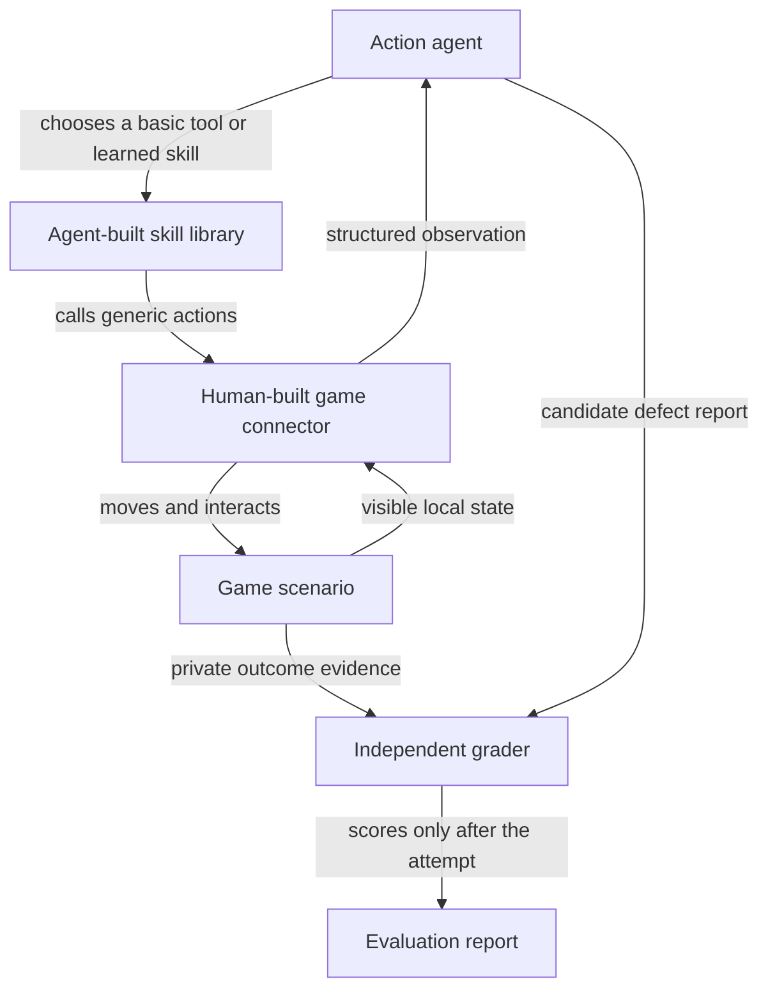
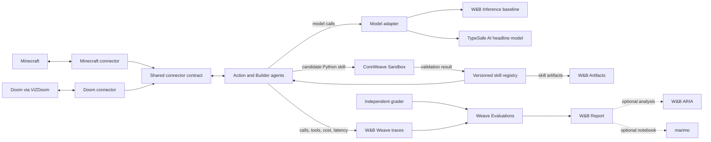
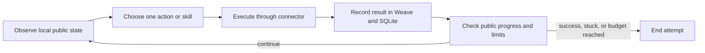
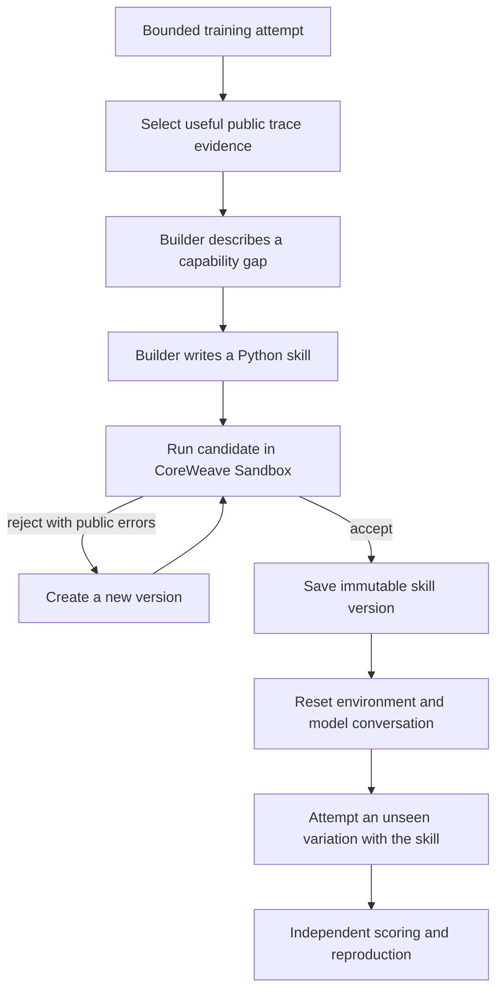
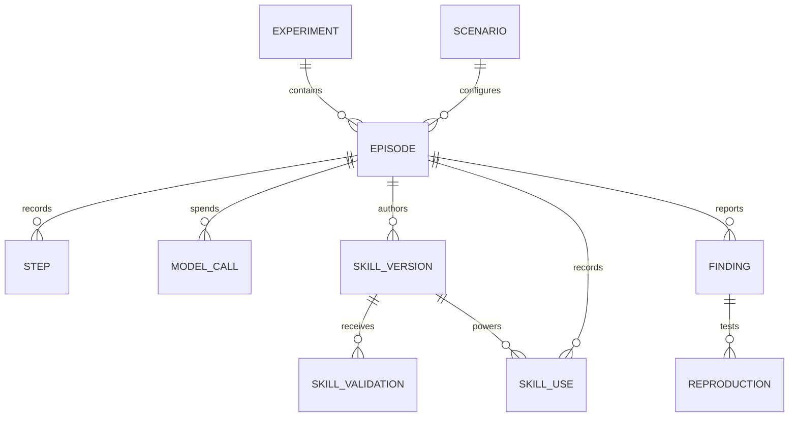

# noob-agent Hackathon Plan

## Status and scope

This document describes the project we intend to build during the CoreWeave
Hacks weekend. It is a plan, not evidence that the hackathon implementation
already exists.

noob-agent began as a TypeScript text-game prototype. The hackathon project is a
new Python implementation of a drop-in agent that can learn to play unfamiliar
games and improve through experience. It will use a W&B Inference open-source
model as the established baseline, an unreleased TypeSafe AI model as the
intended headline experimental model, Weave evaluations, and isolated execution
for model-written skills.

The implementation-level contracts are defined in:

- [`connector_contract.md`](connector_contract.md) for observations, primitive
  tools, step results, timing, and action accounting.
- [`skill_contract.md`](skill_contract.md) for generated Python skills,
  permissions, validation, and immutable versions.
- [`minecraft_scenario.md`](minecraft_scenario.md) for the first public task,
  training and held-out worlds, planted behavior, and private grading.
- [`eval_protocol.md`](eval_protocol.md) for conditions, budgets, metrics,
  failures, and publication rules.

The hackathon will demonstrate the same agent architecture on exactly two
games. Minecraft is the first game and the primary demonstration environment.
Doom, connected through ViZDoom, is the second game. It gives us a fast,
Python-native environment with simple player controls and reliable resets while
being visibly and mechanically different from Minecraft.

The project is drop-in at the learning layer: a game supplies the public goal,
public observations, reset behavior, and the primitive controls available to a
new player. Those primitives are part of the test definition. They are frozen
for every model evaluated on that game, but they do not have to be identical
between games. The Action agent, Builder, skill format, validation process,
storage, budgets, and evaluation logic remain the same.

The event requires eligible work to be built during the hackathon, so the
implementation should begin in a fresh public repository and clearly disclose
the earlier prototype as prior research. We should confirm the acceptable
boundary with an organizer before reusing any existing code.

## 1. What the project is

noob-agent is an evaluation system for measuring how well an AI model learns to
work inside an unfamiliar interactive environment.

Every model starts with the same basic senses and actions. It can observe its
local surroundings, move, inspect objects, pick things up, and interact with
them. It does not receive an explanation of newly introduced objects or the
steps required to reach the final objective.

The model is allowed to experiment. It can then turn useful discoveries into
new Python functions, which we call **skills**. A separate part of the system
tests each skill before it becomes available in later attempts. The evaluation
measures whether this process makes the model more successful, reliable, and
efficient on situations it did not see while learning.

The central question is:

> Given the same new-player controls, unfamiliar environment, feedback, and
> learning budget, how effectively can a model turn experience into a reliable
> skill that works on unseen variations?

Minecraft is the first environment because it is visual, familiar to an
audience, and flexible enough to create unfamiliar rules. Doom is the second
environment because it is real-time, fast, and based on a very different set of
player actions. The two demos are evidence that the learning architecture can
operate across different game interfaces; they are not proof that every game
already works.

## 2. What it does

noob-agent runs a model through two core experimental conditions.

In the **cold condition**, the model attempts a task using only the basic tools
provided by the system. It can reason and experiment, but it cannot carry a
generated skill into the held-out evaluation.

In the **self-improving condition**, the same model receives the same tools and
budget, but it may study its training attempts, create a Python skill, test that
skill, and retain an accepted version. It then attempts unseen variations with
the accepted skill available.

A competition-quality evaluation adds a **budget-matched notes control**. It
gets the same training evidence and learning-call allowance, but carries a short
written playbook instead of executable Python. This tests whether validated
skills add value beyond simply letting the model reflect and remember advice.

The system records the complete process:

- What the model observed.
- What it believed and decided.
- Which basic tool or learned skill it called.
- What changed in the environment.
- What failed and how the model responded.
- Which skills it proposed, repaired, accepted, or rejected.
- Whether the final objective actually succeeded.
- Whether a reported defect was independently confirmed and reproduced.
- How many actions, model calls, tokens, seconds, and dollars the run used.

The output is a reusable evaluation report rather than only a video. A model
team can see which model started strongest, which model learned most, how much
learning cost, whether generated skills transferred, and whether apparently
successful behavior was actually correct.

## 3. Value the project adds

### For model teams

Most task evaluations measure whether a model can solve a fixed task. noob-agent
also measures whether a model can improve its own working abilities during a
bounded learning period.

The result separates several capabilities that are often mixed together:

- Initial ability before learning.
- Ability to explore and form useful hypotheses.
- Ability to turn experience into working code.
- Ability to repair code after a failure.
- Ability to transfer a skill to a new situation.
- Ability to identify and reproduce incorrect behavior.
- Cost and time required to obtain the improvement.

### For game and simulation developers

A developer could provide a scenario, public instructions, a reset operation,
and private success checks. noob-agent would run selected models against it and
produce traces, generated skills, before-and-after measurements, and
reproduction evidence.

The longer-term value is an evaluation kit for unfamiliar mechanics rather
than another agent that only knows the standard rules of one game.

### For agent builders

The project makes self-improvement inspectable. The claimed improvement is not
an unspecified memory update or a longer conversation. It is a concrete,
versioned Python function with tests, parentage, measured cost, and held-out
results.

### How this differs from broader game and Minecraft benchmarks

Existing game environments and Minecraft benchmarks are much larger and better
suited to measuring broad gameplay, reinforcement learning, or thousands of
standard tasks. noob-agent does not claim to replace them.

Its narrower contribution is evaluating adaptation to developer-supplied rules
that are not part of ordinary Minecraft knowledge. It pairs clean and faulty
versions, measures the gain from a persisted skill, evaluates the skill itself,
and requires fresh reproduction before counting a defect.

## 4. Goals

The hackathon implementation should:

1. Give every model the same declared new-player observations and primitive
   actions for a given game, and record that access as part of the test.
2. Present at least one unfamiliar mechanic whose rules are not included in the
   model prompt or tool names.
3. Record every model call, observation, action, skill change, and score.
4. Let a Builder agent create or repair a Python skill from public training
   traces.
5. Validate generated skills in an isolated environment before accepting them.
6. Retain accepted skills across a reset while clearing the model's training
   conversation.
7. Test accepted skills on variations that were not shown during learning.
8. Compare a cold condition with a self-improving condition under the same
   budgets.
9. Compare the unreleased TypeSafe AI model with a W&B Inference open-source
   baseline if the basic product is stable and TypeSafe passes the operational
   gate in section 6.9.
10. Keep task completion, skill correctness, defect discovery, false alarms,
    reproduction, and cost as separate results.
11. Produce a W&B project and report that another person can inspect after the
    live demonstration.
12. Complete a deterministic three-minute demonstration with an honest recorded
    fallback.

## 5. Non-goals

### No custom mod in the first build

We are not initially building a Minecraft mod. None of us currently has modding
experience, and learning a mod loader, build system, game mappings, networking,
and custom assets could consume most of the weekend before the agent loop works.

The first scenario should use a local Java Edition server and the simplest
reliable scenario mechanism available, such as a prepared world, server
commands, command blocks, or a small data pack. It only needs unfamiliar objects,
a discoverable transformation rule, reset support, a clean version, and a faulty
version.

Once the full learning and evaluation loop works, a server-side mod becomes a
stretch goal. The loop must not depend on completing that stretch goal.

### No screen-and-keyboard learning

The model will not learn from raw video or press individual keyboard keys during
the hackathon version. It receives structured local observations and calls
generic actions through a Minecraft connector.

This intentionally measures learning and skill construction without mixing in
camera control, image recognition, menu navigation, and precise movement. A
future version can add screen-and-keyboard access as a separate condition.

### No claim that two demos equal universal support

The product direction is a drop-in learning agent for any game that provides a
small new-player control surface, but the hackathon only has time to demonstrate
Minecraft and Doom. We will not claim universal support from two successful
demos. Generality remains a hypothesis tested through additional game
integrations after the hackathon.

### No model training or weight updates

Self-improvement means building and retaining tested skills. It does not mean
fine-tuning, reinforcement learning, or changing model weights.

### No complete game playthrough

The demo begins from a prepared checkpoint near the final challenge. All normal
prerequisites are already satisfied except the requirement involving the
unfamiliar mechanic. This keeps the causal story clear and the demonstration
short.

### No single opaque intelligence score

We will present a small scorecard. A model can be a good initial player but a
poor learner, or a good learner but an unreliable defect reporter. One weighted
number would hide those differences.

### No production security claim

Generated code will be isolated, time-limited, and given a narrow API. The
weekend prototype will not claim to be a complete security system for arbitrary
hostile code.

### No unnecessary sponsor integrations

We will use sponsor products where they serve the core loop. We will not add a
product solely to list another logo. The primary target is Best Use of Weave,
and every project is also eligible for Best Loop Design.

## 6. Architecture

The project has four conceptual layers. The distinction between the two middle
layers is essential, and the game-specific connector is the replaceable part
that makes the agent drop-in across games.



The **connector** is fixed software written by the team. It gives every model
the same body and senses. The **skill library** is written by the model during
the experiment. It contains knowledge about the unfamiliar mechanic.

### 6.1 Game scenarios

Each game integration contains a scenario with a task that requires learning
from interaction. The environment provides fair, player-visible feedback, but
it does not state the exact procedure. Minecraft is the primary integration.
Doom is the independent portability integration and follows the same episode,
skill, and evaluation contract.

The primary Minecraft scenario family contains:

- A training version where the model may experiment.
- A held-out clean version with changed locations, quantities, or distractions.
- A matched faulty version containing one known incorrect behavior.
- A reliable reset operation.
- Private checks for progress, success, and the known defect.

The public task wording should be the same for clean and faulty versions. The
model should not be told that a bug exists.

The Doom portability slice is smaller: one training scenario and held-out
variations with changed starting and target positions. It does not need a
planted defect for the BDP.

### 6.2 Generic game connector

Each game has a human-built connector that exposes the same conceptual
interface to the agent: public observations, primitive actions, reset support,
and action results. The connector hides transport details, but the primitive
tool set is not hidden or standardized away. It represents the controls a new
player is given when starting that game and is therefore part of the benchmark
manifest.

Minecraft uses a mature Minecraft automation library and a small Python-facing
tool API. Doom uses ViZDoom's Python API. Their exact actions differ, while both
connectors implement the same outer contract:

```python
reset(scenario_id, seed) -> Observation
public_goal() -> str
primitive_tools() -> list[ToolDefinition]
step(tool_name, arguments) -> Observation
is_terminal() -> bool
close() -> None
```

Private grading is deliberately separate from this public connector.

Example actions include:

```python
observe_nearby(radius=5)
move_to(position)
look_at(position)
inspect_object(position)
pick_up(object_id)
use_object(position)
open_container(position)
transfer_object(object_id, count, destination)
place_object(object_id, position)
remove_object(position)
wait(ticks)
```

These tools may reveal public names, local positions, or game-specific
equivalents. They do not reveal purpose, valid combinations, hidden state, the
correct solution, or whether the scenario is faulty.

The connector enforces an action limit and records the intent before sending an
action. It never silently retries an action whose result is uncertain.

#### Minecraft primitives

Minecraft primitives cover the controls needed by a new player to observe,
move, look, collect, place, remove, and use nearby objects. They do not include
the meaning of an unfamiliar object or a function that solves the new mechanic.

#### Doom primitives

Doom primitives stay close to its ordinary player controls:

```python
observe()
move_forward(duration)
move_backward(duration)
strafe_left(duration)
strafe_right(duration)
turn_left(amount)
turn_right(amount)
attack(duration)
use()
wait(ticks)
```

The spectator sees the normal game screen. For the BDP, the model receives a
text summary derived from publicly visible information: status values such as
remaining health and ammunition plus ViZDoom's labels for objects currently in
view. This is a declared structured-observation condition and must be used
identically for every compared model. It must not be described as a pixels-only
result.

The first Doom scenario should use an included ViZDoom scenario rather than a
custom level. During training, the agent learns a short skill such as locating,
approaching, and engaging a visible target without wasting its limited actions.
Held-out attempts change the starting position and target position. This is a
portability test for the learning loop, not a claim that the agent has mastered
the full game.

### 6.3 Action agent

The Action agent receives the public goal, current structured observation,
bounded recent history, generic tool definitions, and any accepted skills
allowed in its experimental condition.

On each step it chooses exactly one tool or skill. It also returns a short
machine-readable statement of its current subgoal and what evidence it expects
the action to produce. This makes repeated guesses and weak experiments visible
without requiring judges to inspect hidden reasoning.

The Action agent cannot read scenario source, private grader data, or files on
the host.

### 6.4 Builder agent

The Builder receives selected public observations, actions, errors, and outcomes
from training attempts. It identifies a repeated procedure or capability gap
and proposes a Python skill.

A skill is more than a recorded action sequence. It should include:

- A name and plain-language purpose.
- Required inputs and starting conditions.
- Calls to the generic connector.
- A visible success check.
- Expected changes to the environment.
- Clear failure results.
- Bounded recovery for known failures.

For example:

```python
async def create_required_tool(context: SkillContext) -> SkillResult:
    """Use the unfamiliar processing device and verify its output."""
    ...
```

The Builder may repair a rejected skill, but it cannot edit the connector,
grader, budgets, scenario, or its own acceptance rules.

### 6.5 Skill validator and CoreWeave Sandbox

Model-written Python is untrusted. Each candidate is sent to a fresh CoreWeave
Sandbox with only the candidate, the allowed skill API, and bounded test
fixtures. The sandbox has time, memory, and network limits.

Validation occurs in stages:

1. Parse the file and reject forbidden imports or APIs.
2. Load the function and verify its declared input and output shape.
3. Run it against recorded training examples.
4. Run negative cases such as missing inputs and failed actions.
5. Repeat examples to catch unstable behavior.
6. Run a small validation variation not used to write the candidate.

Passing these checks means the skill is safe enough and consistent enough for
the experiment. It does not prove broad correctness. If CoreWeave Sandbox access
is unavailable, the fallback is a restricted local subprocess, and the team
must describe that weaker isolation honestly.

### 6.6 Skill registry

Every candidate receives an immutable version. The registry stores its source,
parent version, authoring trace, validation results, creation cost, and status.

Only accepted versions appear in the Action agent's tool list. A repaired skill
creates a new version rather than overwriting the old one. This makes the
improvement visible and reversible.

### 6.7 Independent grader and reproduction

The grader may inspect private scenario state, but its evidence never enters the
Action or Builder prompts during an evaluated attempt.

After an attempt, it decides:

- Whether the final objective was actually completed.
- Which intermediate milestones were reached.
- Whether a reported defect occurred.
- Whether the same defect is absent from the matched clean version.
- Whether a fresh reset and reproduction attempt confirm it.

The model's statement that it succeeded or found a bug is never sufficient by
itself.

### 6.8 Quantified evaluation

The core comparison crosses models with two conditions:

| Condition | Basic tools | Artifact retained after reset |
| --- | --- | --- |
| Cold baseline | Yes, declared per game | None |
| Self-improving | The same tools as that game's baseline | Validated Python skill |
| Budget-matched notes | The same tools as that game's baseline | Bounded text playbook |

The harness, prompts, per-game primitive tools, budgets, scenario list, starting
seeds, and grader remain fixed while the model changes. A Minecraft model is
compared only with other models receiving the same Minecraft primitives; a Doom
model is compared only with other models receiving the same Doom primitives.
Cross-game aggregation must retain the access condition instead of pretending
the games expose identical controls. The model is used as both the Action agent
and Builder in the headline comparison, so the unit being evaluated is the
complete model-powered agent inside a fixed noob-agent protocol.

The scorecard reports:

- Cold success rate.
- Post-learning held-out success rate.
- Adaptation lift: post-learning success minus cold success.
- Intermediate progress on failed attempts.
- Skill validation and held-out reliability.
- Actions, model calls, tokens, time, and dollars required to learn.
- Actions and cost required to complete successful held-out attempts.
- Fault detection rate.
- False-alarm rate on clean scenarios.
- Fresh reproduction rate.

The main graph is a cold-to-learned slope chart:

```text
Verified held-out success

Model A       25%  ------------------------------> 75%
Model B       60%  --------------->                80%
              Cold                         Self-improving
```

The second graph is a learning curve:

```text
Held-out
success
  100% |                            o
       |                     o------
       |              o------
       |       o------
    0% |o------
       +----------------------------------------
        cumulative learning calls, tokens, or $
```

The W&B report should also include a cost-versus-success scatter plot and a
scenario heatmap. For the small hackathon sample, show individual run points and
the number of runs instead of implying strong statistical certainty.

### 6.9 Sponsor products and where they fit



#### W&B Inference

The established open-source baseline uses W&B Inference through its
OpenAI-compatible Python API. The model adapter keeps provider-specific setup
outside the Action and Builder agents so evaluated models receive the same
prompts, tools, budgets, and scoring protocol. Each run records the provider,
exact model identifier, settings, usage, latency, purpose, and error. Unknown
usage remains unknown rather than being treated as zero.

W&B Inference is a core dependency and the live fallback, not an ornamental
integration.

#### W&B Weave traces

Weave records the two loops as nested operations. A top-level episode contains
observation, decision, tool execution, scoring, skill authoring, sandbox
validation, and repair spans. The demo can open one failed step and show the
exact evidence that led to a new skill.

Trace plots show latency, model usage, cost, repeated actions, and failures.

#### Weave Evaluations and W&B Reports

Each evaluation episode logs its inputs, outputs, private scores, and summary
metrics. The comparison report contains the cold-to-learned graph, learning
curve, scenario heatmap, cost-versus-success plot, and defect scorecard.

The W&B project is part of the deliverable. Judges should be able to inspect a
headline number and then drill down to the exact trace behind it.

#### W&B Artifacts

Scenario manifests, evaluation splits, and accepted skill versions can be
stored as versioned artifacts. This creates a visible line from the training
trace to the generated skill and from that skill to its held-out results.

SQLite remains the local authoritative record during execution. Artifact upload
must not become a dependency for safely finalizing a local episode.

#### W&B MCP server

If time permits, the Builder or a separate analysis agent uses the W&B MCP
server to retrieve the worst failed training traces and summarize recurring
failure patterns. This makes W&B data part of the improvement loop rather than
only a destination for logs.

The basic product can select traces from the local store if MCP integration is
not ready. We should not delay the end-to-end loop for it.

#### CoreWeave Sandbox

CoreWeave Sandbox executes model-written skill code in an isolated,
policy-controlled environment. This is its core role in the project. It may
also run evaluation jobs in parallel after the single-episode path works.

Sandbox access is currently a platform prerequisite, so we should ask the
onsite sponsor team about credentials, available profiles, permitted container
images, networking, and startup latency at the beginning of the event.

#### W&B ARIA

ARIA is optional and should remain outside the private grader. If available, we
can use it after experiments finish to analyze patterns across runs, propose
useful report panels, and create a shareable W&B Report. It must not modify
scores or feed held-out answers back into the evaluated models.

#### marimo and molab

An optional marimo notebook can make the evaluation dataset and graphs
reproducible in a single Python file. It is a stretch deliverable if the W&B
report is already complete. We should not build a second dashboard merely to
use another sponsor product.

#### TypeSafe AI and other sponsor tools

The unreleased TypeSafe AI model is the intended headline experimental model.
Its novelty creates a strong hackathon story: noob-agent can provide an early,
inspectable evaluation of its claimed speed and programmatic structure against
an established open-source baseline. Those properties are hypotheses to test,
not conclusions to repeat before results exist.

TypeSafe must pass a time-boxed operational gate before it is used in the live
demo or headline comparison:

1. It reliably emits the structured actions and Python skills required by the
   shared protocol.
2. Its API completes several consecutive representative runs without an
   unacceptable failure rate.
3. Its latency is safe for the three-minute demo.
4. Inputs, outputs, timing, usage when available, and errors can be recorded in
   Weave without losing comparability.
5. TypeSafe permits the team to publicly name and benchmark the unreleased
   model.
6. The team can describe any special speed-oriented setup without disclosing
   confidential information.

If it passes, the primary comparison is TypeSafe versus the W&B Inference
baseline under identical prompts, tools, conditions, budgets, scenarios, and
seeds. The intended presentation is the first evaluation of an unreleased
programmatic model, supported by reproducible traces rather than an unsupported
claim that it is better. If it fails the gate or becomes unavailable, the W&B
Inference model becomes the live model and TypeSafe results, if valid, are
shown only as an experimental appendix. The core loop must never depend on
TypeSafe availability.

Other sponsor models remain optional third-model comparisons after the primary
campaign completes cleanly. They must use the same protocol and must not
receive different tools or hidden assistance.

## 7. The two loops and exact self-improvement process

There are two loops operating at different speeds.

### 7.1 Fast action loop

The Action agent repeats this loop while an attempt is active:



This is ordinary agent behavior. By itself, it is not self-improvement.

An attempt stops when it succeeds, reaches its action or time budget, repeats
the same failure too often, makes no measurable progress for a fixed window, or
encounters an infrastructure failure.

### 7.2 Slow improvement loop

The improvement loop turns experience into a persistent capability:



The exact sequence is:

1. The model makes a cold training attempt using only generic tools.
2. The system records its observations, actions, errors, and visible progress.
3. A fixed rule detects that the attempt ended or became stuck.
4. The Builder receives a bounded selection of public trace evidence.
5. The Builder names the missing capability and writes one Python skill.
6. The candidate is stored before execution so rejected attempts remain visible.
7. CoreWeave Sandbox checks loading, allowed API use, time limits, training
   examples, negative cases, repeatability, and one validation variation.
8. A rejected skill may be repaired a small fixed number of times. Each repair
   becomes a new version and consumes model budget.
9. An accepted skill enters the skill registry and appears in the Action
   agent's tool list.
10. The environment and model conversation are reset. The accepted skill is the
    only learning artifact carried forward.
11. The Action agent attempts held-out clean and faulty variations.
12. The independent grader scores results and attempts fresh defect
    reproduction. Held-out grader feedback never returns to the Builder.

The system has improved only when the next attempt starts with an accepted skill
that did not exist before and that skill improves held-out results. Generating
code, passing a training example, or retaining a long conversation is not enough.

### 7.3 What can change and what stays fixed

| May change during learning | Must remain fixed |
| --- | --- |
| Generated skill source | Generic connector |
| Skill version and parent | Private grader |
| Model's training hypotheses | Scenario split |
| Accepted skill library | Budgets and stop rules |
| Public training trace selection | Evaluation prompts |
| | Held-out scenario contents |

This boundary prevents the system from improving its score by editing the test.

## 8. Proposed technology stack

### Application and evaluation

- Python 3.11 or newer.
- `asyncio` for bounded orchestration.
- Pydantic for observations, actions, skills, reports, and stored records.
- Typer for a small command-line interface.
- SQLite for durable local episode records.
- `pytest` for deterministic unit and integration tests.

### Models and observability

- A provider-neutral model adapter shared by the Action and Builder agents.
- A W&B Inference open-source baseline through the OpenAI Python client.
- The unreleased TypeSafe AI model through its supported API, contingent on the
  section 6.9 operational gate.
- W&B Weave Python SDK for nested traces and evaluations.
- W&B Reports for the final comparison.
- W&B Artifacts for versioned scenarios and accepted skills when time permits.

### Game connection

- Minecraft Java Edition, with the version frozen after confirming support.
- A local server and prepared scenario world.
- Node.js and Mineflayer as a thin game-protocol sidecar.
- JSON Lines or a local WebSocket between the sidecar and Python.
- A data pack, server commands, or command blocks for the initial unfamiliar
  mechanic, reset, and private score signals.
- Doom through ViZDoom's Python API and Gymnasium-compatible environment.
- An included ViZDoom scenario for the first Doom integration, with fixed seeds,
  short episodes, and no custom level required for the BDP.

The intelligence and evaluation code remain in Python. We do not rewrite the
Minecraft network protocol in Python merely to claim one language.

### Skill execution

- CoreWeave Sandbox through its Python SDK for candidate validation.
- A narrow `SkillContext` API; generated skills cannot import arbitrary packages
  or access credentials.
- Per-call wall-time, output-size, and action limits.
- A restricted local subprocess fallback if sandbox access is unavailable.

### Suggested commands

The final names may change, but the workflow should stay this simple:

```sh
noob-agent run --scenario training-01 --model <model> --condition adaptive
noob-agent run --scenario heldout-clean-01 --model <model> --condition cold
noob-agent run --scenario heldout-clean-01 --model <model> --condition adaptive
noob-agent verify --episode <episode-id>
noob-agent reproduce --finding <finding-id>
noob-agent compare --models <model-a> <model-b>
```

## 9. Proposed data model

SQLite is the local source of truth. Weave receives the trace and evaluation
views needed for analysis and presentation.



### Experiment

One comparison configuration: model, prompts, condition, budgets, connector
version, scenario split version, skill policy, and grader version.

### Scenario

Scenario identifier, game identifier, split (`training`, `validation`, or
`held-out`), reset method, public task, seed, primitive-tool manifest, public
observation mode, clean or faulty identity, build fingerprint, and private
grader version. The clean or faulty identity is never sent to the model.

### Episode

A single attempt: experiment, scenario, model, starting skills, timestamps,
actual outcome, stop reason, total actions, total usage, total cost, and final
progress.

### Step

Sequence number, exact public observation, chosen tool or skill, arguments,
result, visible state change, delivery status, latency, and repeated-action
markers.

### Model call

Purpose (`action`, `build`, `repair`, or `report`), request and response,
provider model, settings, reported token usage, latency, retry information, and
error. Credentials are never stored.

### Skill version

Name, source, hash, parent version, authoring episode, authoring evidence,
status, creation usage, allowed API version, and creation time.

### Skill validation

Skill version, fixture or variation, sandbox identifier, result, duration,
error, and individual check results.

### Skill use

Episode, step, skill version, inputs, result, primitive actions consumed, and
whether the skill's own success check passed.

### Finding

Candidate defect description, expected behavior and its public basis, actual
behavior, related observations and actions, reporting model, and private
verification status.

### Reproduction

Finding, fresh scenario reset, attempted action sequence, result, private
predicate result, and first mismatch if reproduction failed.

## 10. Basic Demoable Product (BDP)

The BDP is the smallest vertical slice that proves the idea. It is complete only
when all of the following work together:

1. Two game integrations can start and reset reliably: Minecraft and Doom
   through ViZDoom.
2. Python can observe each game and perform the required generic actions through
   its game-specific connector.
3. One W&B Inference model can complete a bounded cold attempt in both games.
4. The attempt appears as a readable nested trace in Weave.
5. The Builder produces one Python skill from that trace.
6. CoreWeave Sandbox, or the clearly labeled local fallback, accepts or rejects
   the skill using automated checks.
7. An accepted skill appears in the next Action agent's tool list.
8. A fresh held-out variation uses the skill successfully.
9. The Minecraft integration includes a matched faulty variation that produces
   a candidate defect.
10. A fresh Minecraft reset independently reproduces or rejects that defect.
11. Cold and self-improving results appear in one W&B evaluation comparison.
12. The complete story can be shown in three minutes or less.

The Doom BDP proves the connector and learning loop transfer to a different
kind of game. It does not require a custom Doom level or a planted Doom defect.
The overall BDP also does not require multiple models, a custom Minecraft mod,
MCP trace selection, ARIA, marimo, or large-scale parallel evaluation.

### Competition-quality target after the BDP

Once the vertical slice is stable, first run the two core conditions:

```text
2 models x 2 conditions x 2 games x 2 held-out variations x 3 fixed seeds
= 48 episodes
```

Then add the budget-matched notes control, bringing the competition-quality
campaign to 72 held-out episodes. Publish the individual run points, averages,
sample counts, failures, and costs. Add a third model only if the first campaign
completes cleanly.

### Suggested build order

#### Pre-BDP implementation foundation

Before the first connector milestone, create the Python project foundation:

- a Python 3.11+ `src/noob_agent` package with a thin CLI entry-point reserved;
- Pydantic, Typer, and pytest tooling, including pytest async support;
- package, domain, runtime, storage, connector, agent, skill, grading,
  verification, prompt, and deterministic-test directory boundaries;
- a minimal import test that proves the project can be discovered from the
  `src` layout.

This foundation is not a BDP claim and contains no runner behavior, connector
implementation, live service integration, generated-skill execution, or game
logic. The next approved milestone defines the typed contracts and deterministic
fake connector, test first.

#### Integration infrastructure seams

The initial foundation also defines configuration and provider-neutral seams for
W&B Inference, W&B Weave, and CoreWeave Sandbox. They default to disabled and
must not authenticate, make network calls, or become required by tests. SQLite
remains authoritative; tracing is a best-effort mirror only after local episode
state is durable. The sandbox seam represents bounded execution but does not
execute generated code until the approved skill-runtime milestone.

1. Minecraft reset and one hard-coded action through its connector.
2. One complete Minecraft cold episode recorded locally and in Weave.
3. One hand-written skill through the same validation and registry path.
4. Replace the hand-written skill with a Builder-generated candidate.
5. Held-out reset and successful skill reuse.
6. Clean/faulty pair and independent reproduction.
7. Add the ViZDoom connector without changing the shared loop.
8. Run one Doom cold, learning, and held-out sequence.
9. Add the comparison runner and report.
10. Add optional sponsor extensions and a server-side mod.

Using a hand-written skill in step 3 tests the plumbing. It must not appear in
the final adaptive evaluation as a model-generated result.

## 11. Demo design

The demonstration should show the same drop-in learning agent in two prepared
games. Minecraft is shown first, followed by Doom through ViZDoom. Minecraft
starts near its final challenge with ordinary prerequisites complete; the
missing requirement depends on its unfamiliar mechanic. Doom uses a short
included scenario with different starting and target positions.

The audience should see three surfaces:

1. The active game's view (Minecraft first).
2. A small terminal panel showing the current generic tool list and accepted
   skills.
3. The W&B trace and comparison report, including the cross-game result.

The central visual transformation is:

```text
Before learning                        After learning

observe                                observe
move                                   move
pick_up                                pick_up
use                                    use
place                                  place
                                       create_required_tool   NEW
```

The second attempt must use a changed layout or inputs and a cleared model
conversation. Otherwise the demo only shows continuation or memorization.

### Demo reliability rules

- Keep the live scenario under one minute.
- Use fixed scenario seeds and strict budgets.
- Prepare an exact replay of a real cold attempt.
- Prepare a verified accepted skill before judging as a fallback.
- Have a sub-two-minute screen recording ready.
- Never present a scripted skill as model-generated.
- Label replays as replays.
- Do not depend on a live model call if venue networking is unstable.
- Open all W&B pages and terminal panes before the presentation begins.

## 12. Three-minute demo timeline

### 0:00-0:20 - The question

Show the unfamiliar mechanic in Minecraft and say:

> Models can use software tools, but can they enter an unfamiliar environment,
> discover a new rule, and turn that experience into a reliable tool of their
> own? noob-agent measures that learning process.

Show the initial generic tool list. There is no skill for the new mechanic.

Briefly state that the same drop-in learning layer will repeat the loop in Doom
using Doom's normal new-player controls.

### 0:20-0:45 - Cold attempt

Play an exact replay or short live cold attempt. The agent discovers unfamiliar
objects, makes a plausible interaction, repeats or fails, and reaches its small
budget without completing the objective.

Show a compact result:

```text
Goal completed: no
Progress: 1 of 3 milestones
Actions: 17
Repeated failures: 4
Accepted skills: 0
```

### 0:45-1:15 - The improvement

Open the failed Weave trace. Highlight the observation, action, and state change
that the Builder used as evidence.

Show the generated skill in plain language, then show CoreWeave Sandbox checks:

```text
Loads with allowed API                 PASS
Completes training example             PASS
Handles missing input                  PASS
Works after a location change          PASS
Repeats consistently                   PASS

Skill accepted: create_required_tool v1
```

The terminal tool list updates to show the new skill.

### 1:15-1:55 - Fresh transfer

Reset to an unseen variation with changed locations or quantities and a cleared
conversation. The Action agent recognizes the need for the new skill, calls it,
and completes the prepared final objective.

```text
Goal completed: yes
Actions: 8
Repeated failures: 0
Learned skill used: create_required_tool v1
```

### 1:55-2:10 - Doom transfer

Switch to Doom and show a short held-out attempt with a changed starting or
target position. The available primitives now look like Doom's ordinary player
controls, not Minecraft's tools. Use a short live run if it is reliable;
otherwise show an exact recorded run and label it as a replay. Make clear that
the game and primitive tool manifest changed, while the Action agent, Builder,
skill registry, validation, and evaluation protocol stayed the same.

### 2:10-2:30 - Defect and reproduction

The faulty version produces an incorrect before-and-after state. The learned
skill notices because it includes an expected result check.

Show the short report:

```text
Expected: two inputs consumed, one output produced
Observed: two inputs consumed, two outputs produced
```

Select **Reproduce**. A fresh reset repeats the evidence sequence, and the
private grader displays `CONFIRMED`. If the live reproduction is too slow, show
its already verified exact replay and label it clearly.

### 2:30-2:50 - Cross-game result

Finish on the W&B Report. Show the cold-to-learned slope chart for Minecraft
and the second game, plus cost, held-out skill reliability, clean false alarms,
and reproduction rate. If the comparison campaign is complete, show two models.

### 2:50-3:00 - Closing line

> noob-agent is a drop-in agent for learning unfamiliar games. It does not just
> test whether a model can act: it measures whether the model can turn
> experience into reliable software, transfer it to unseen situations, and use
> it to produce evidence another tester can reproduce.

## 13. Approved core-loop milestone: build-order steps 1-3

This section is the explicit approval required by `CLAUDE.md` and `AGENTS.md`
before touching protected core-loop interfaces. It covers exactly build-order
steps 1-3 from section 10: a real Minecraft connector reset and one hard-coded
action, one recorded cold episode, and one hand-written skill through
validation and registry. Tracked as GitHub issues #13, #14, and #15.

It authorizes touching game connectors, the scenario reset/action path, the
generated-skill runtime and registry, and tracing (as a best-effort mirror
only, through the existing disabled-by-default seam). It does not authorize
touching the Action agent, the private grader, the evaluation harness, or the
report-generation path; those remain gated separately. Builder-generated
skills, held-out reuse, the clean/faulty pair, the ViZDoom connector, and the
comparison runner (build-order steps 4-10) are out of scope here.

### Step 1 - Minecraft connector: reset and one hard-coded action (#13)

- Files: new `src/noob_agent/connectors/protocol.py` (typed `GameConnector`
  Protocol per `connector_contract.md`); new
  `src/noob_agent/connectors/minecraft.py` (`MinecraftConnector` implementing
  `manifest/reset/step/is_terminal/close`). Game connection follows section 8:
  a Node.js/Mineflayer sidecar process, driven from Python over JSON Lines on
  the sidecar's stdio, with no new Python dependency required. The sidecar
  lives in its own directory with its own `package.json`; it is the only new
  external dependency and is already named in section 8, so no separate
  dependency approval is required.
- Tests first: `tests/test_connectors_minecraft.py` - reset repeatability on a
  fixed seed, one hard-coded action (`observe`) returns a schema-valid
  `StepResult`, timeout classification. Skips cleanly, not silently, if the
  local server or sidecar is unavailable.
- Validation: `uv run pytest tests/test_connectors_minecraft.py -v` against
  the local server per `docs/minecraft-server.md`.
- Acceptance: BDP criteria 1-2 (Minecraft integration starts/resets reliably;
  Python observes and acts through its connector).

### Step 2 - One complete cold episode, recorded locally and in Weave (#14)

- Files: new `src/noob_agent/runtime/runner.py` (episode loop enforcing
  budgets and action-ID idempotency from `connector_contract.md`); new
  `src/noob_agent/storage/schema.py` and `src/noob_agent/storage/repository.py`
  (SQLite, authoritative per section 9); extend
  `src/noob_agent/observability/tracing.py` to mirror episode/step only when
  `TraceSettings.enabled`.
- Tests first: `tests/test_episode_runner.py` (deterministic cold run against
  a stub connector); `tests/test_storage_repository.py` (episode/step
  persistence round-trip).
- Validation: `uv run pytest tests/test_episode_runner.py
  tests/test_storage_repository.py -v`; manual: one live cold episode against
  the local server, confirm the SQLite row and, if Weave credentials are set,
  a trace.
- Acceptance: BDP criteria 3-4 (bounded cold attempt; readable nested Weave
  trace).

### Step 3 - One hand-written skill through validation and registry (#15)

- Files: new `src/noob_agent/skills/contract.py` (`SkillContext`/`SkillResult`
  per `skill_contract.md`); new `src/noob_agent/verification/validator.py`
  (AST-based permission and size-limit check); new
  `src/noob_agent/skills/registry.py` (immutable version/hash assignment,
  tool-list exposure). The fixture skill lives under `tests/fixtures/skills/`;
  per section 10 it tests plumbing only and must never appear as a
  model-generated result later.
- Tests first: `tests/test_skill_validator.py` (rejects disallowed
  imports/network/exec, accepts a compliant skill); `tests/test_skill_registry.py`
  (version/hash immutability).
- Validation: `uv run pytest tests/test_skill_validator.py
  tests/test_skill_registry.py -v`.
- Acceptance: BDP criteria 5-6 (one skill produced; sandbox or local fallback
  accepts or rejects it via automated checks).

## 14. Approved core-loop milestone: build-order steps 4-6

This section is the explicit approval required by `CLAUDE.md` and `AGENTS.md`
before touching protected core-loop interfaces. It extends section 13 to cover
exactly build-order steps 4-6 from section 10: a Builder-generated candidate
replacing the hand-written skill, a held-out reset with successful skill reuse,
and a matched clean/faulty pair with independent reproduction. Tracked as
GitHub issues #22, #23, and #24.

It authorizes touching the Builder agent, the Action agent, the model-provider
seam, the generated-skill runtime, the private grader, the held-out evaluation
path, and the storage schema where findings and reproductions must be recorded.
It does not authorize touching the comparison runner or the report-generation
path (build-order step 9), the connector contract, the budgets and stop rules,
the evaluation prompts, or the held-out scenario contents; section 7.3 holds
those fixed. The ViZDoom connector (step 7) and the Doom sequence (step 8)
remain out of scope here.

### Prerequisites

- **A configured model provider.** `NOOB_AGENT_MODEL_PROVIDER` defaults to
  `disabled` and there is no `.env`. Step 4 is defined by a model writing the
  skill, so the automated tests run against a deterministic fake provider and
  one live run is a manual validation step. No test may require credentials or
  a network call.
- **The skill-runtime milestone below**, which is what permits executing a
  generated candidate at all.

### Skill-runtime milestone: executing a generated candidate

Section 10 states that the sandbox seam "does not execute generated code until
the approved skill-runtime milestone." This is that approval, and it is narrow.

- Candidate code is executed only through `SandboxExecutor`. The harness never
  imports, `exec`s, or otherwise loads a candidate into its own process.
- `DisabledSandboxExecutor` remains the default. Execution happens only when a
  sandbox mode is explicitly configured.
- A candidate is recorded in the registry as `proposed` before any execution is
  attempted, so a rejected attempt stays visible (section 7.2, step 6).
- Execution sits behind the package and static-policy checks that already
  reject forbidden imports and constructs. A candidate failing those is never
  executed.
- When CoreWeave Sandbox is unavailable, the local fallback is a restricted
  subprocess and must be labeled as weaker isolation wherever a result is
  reported, per section 6.5.

### Step 4 - Builder-generated candidate (#22)

- Files: new `src/noob_agent/models/client.py` (provider-neutral model client
  over the existing `settings.py` seam); new
  `src/noob_agent/agents/evidence.py` (bounded public-trace selection from a
  recorded episode); new `src/noob_agent/agents/builder.py`; new
  `src/noob_agent/prompts/builder.py`. The candidate carries what section 6.4
  requires: name, purpose, required inputs, connector calls, a visible success
  check, expected changes, failure results, and bounded recovery.
- Tests first: `tests/test_builder_agent.py` - a fake provider yields a
  deterministic candidate; the candidate is recorded `proposed` before
  validation runs; a rejection produces a repair carrying `parent_version`
  while the rejected record is unchanged; the repair budget is finite and
  exhausting it ends the loop with a recorded reason; the Builder's evidence
  never carries private grader state, held-out data, or clean/faulty identity.
- Validation: `uv run pytest tests/test_builder_agent.py -v` against the fake
  provider; manual: one live run once a provider is configured.
- Acceptance: BDP criteria 5-7 (the Builder produces one skill from the trace,
  automated checks accept or reject it, an accepted skill reaches the next
  Action agent's tool list).

### Step 5 - Held-out reset and skill reuse (#23)

- Files: new `src/noob_agent/agents/action.py`; new
  `src/noob_agent/skills/runtime.py` (invoke an accepted skill, recording and
  charging every nested primitive per `connector_contract.md`); new
  `src/noob_agent/runtime/heldout.py`; new `src/noob_agent/prompts/action.py`.
  The evaluation prompt is fixed across compared models once written.
- Tests first: `tests/test_heldout_episode.py` and
  `tests/test_skill_runtime.py` - an accepted skill appears in the tool list
  and proposed, rejected, and retired versions do not; nested primitives are
  recorded and charged; reset clears the model conversation so no prior-episode
  content survives; a skill cannot call another generated skill; budgets still
  stop the episode with a recorded stop reason when a skill is in play; a
  held-out scenario is never handed to validation.
- Validation: `uv run pytest tests/test_heldout_episode.py
  tests/test_skill_runtime.py -v` against the fake connector; manual: one
  held-out run against the local server per `docs/minecraft-server.md`.
- Acceptance: BDP criteria 7-8 (accepted skill in the tool list; a fresh
  held-out variation uses it successfully).

### Step 6 - Clean/faulty pair and independent reproduction (#24)

- Files: new `src/noob_agent/domain/findings.py` (`Finding` and `Reproduction`
  records per section 9); new `src/noob_agent/grading/grader.py`; new
  `src/noob_agent/grading/reproduction.py`; extend
  `src/noob_agent/storage/schema.py` and `repository.py` to persist findings
  and reproductions. This schema extension is approved here: it adds tables and
  raises `SCHEMA_VERSION`, and the pull request must state how an existing
  database at the previous version is handled.
- Tests first: `tests/test_grader.py` and `tests/test_reproduction.py` - a
  claimed defect with no private predicate hit is rejected however confidently
  it was reported; a defect present in the faulty variation and absent in the
  matched clean twin is confirmed; a defect that also fires in the clean twin
  is rejected as normal behavior; a failed reproduction records the first
  mismatch; no grader predicate, private state, or clean/faulty label ever
  reaches a prompt or a public record; `scenario_id` never encodes clean or
  faulty identity.
- Validation: `uv run pytest tests/test_grader.py tests/test_reproduction.py
  -v`; manual: one clean/faulty pair run against the local server.
- Acceptance: BDP criteria 9-10 (a matched faulty variation produces a
  candidate defect; a fresh reset independently reproduces or rejects it).

## References

- [CoreWeave Hacks Participant Handbook](https://wandbai.notion.site/CoreWeave-Hacks-Participant-Handbook-3c9e2f5c7ef380eab21ecdde12620caf)
- [W&B Serverless Inference](https://docs.wandb.ai/inference)
- [W&B Weave EvaluationLogger](https://weave-docs.wandb.ai/guides/evaluation/evaluation_logger)
- [W&B Weave trace plots](https://weave-docs.wandb.ai/guides/tracking/trace-plots/)
- [W&B MCP and Weave](https://docs.wandb.ai/weave/guides/integrations/mcp)
- [W&B ARIA](https://docs.wandb.ai/aria/overview)
- [CoreWeave Sandbox](https://docs.coreweave.com/products/sandboxes)
- [CoreWeave Sandbox Python quickstart](https://docs.coreweave.com/products/sandboxes/get-started)
- [Mineflayer](https://github.com/PrismarineJS/mineflayer)
- [ViZDoom documentation](https://vizdoom.farama.org/)
- [ViZDoom repository](https://github.com/Farama-Foundation/ViZDoom)
- [marimo documentation](https://docs.marimo.io/)
- [MineDojo](https://proceedings.neurips.cc/paper_files/paper/2022/hash/74a67268c5cc5910f64938cac4526a90-Abstract.html)
- [Minecraft Universe](https://proceedings.mlr.press/v267/zheng25j.html)
- [Voyager](https://arxiv.org/abs/2305.16291)
